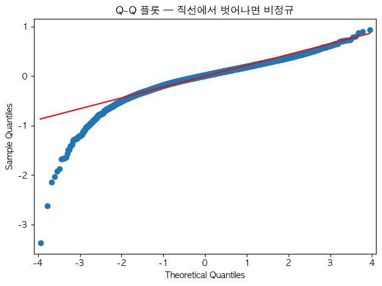
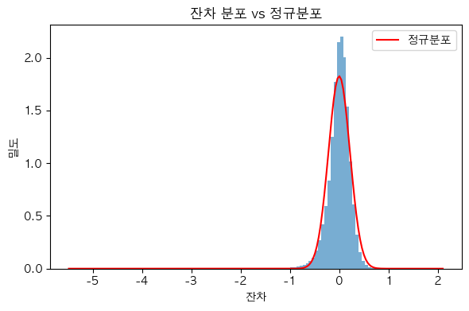
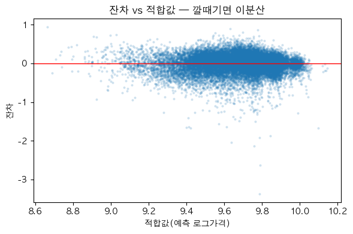
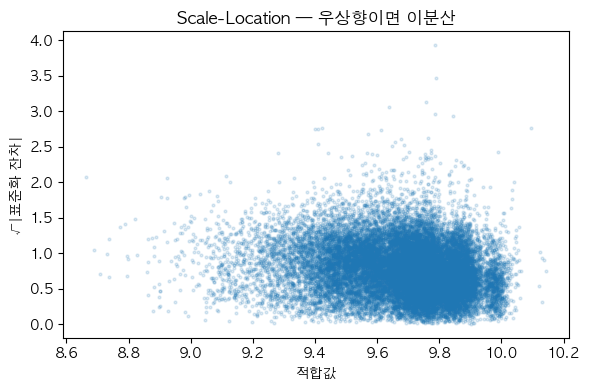

# 21회차. 잔차 진단 — 회귀 가정 점검 (최종판)

> **팀**: 회귀팀(트랙2) | **입력**: 20회차 산출물 `20_residuals.csv` + `20_X_design.*` (+ `20_regression_artifacts.pkl`)
> **선행**: 20회차에서 OLS(HC1)를 적합하고 잔차·설계행렬을 저장했다(셀 14). 이번 회차는 그 잔차로 **OLS 4대 가정이 지켜지는지** 검사한다.
> **한 줄 요약(스포일러)**: 정규성은 눈에 띄게 위반(왜도·첨도 큼), 이분산은 *있으나 약함*, 영향점은 경미 → **20회차가 이미 HC1 강건표준오차로 대비**해 둔 게 정답이었음을 데이터로 확인한다.

## 학습 목표

1. 잔차진단이 **왜 OLS에만** 필요하고 규제회귀엔 불필요한지 안다
2. 4대 가정(선형성·독립성·등분산·정규성)을 **그림 + 검정**으로 점검한다
3. **빅데이터의 함정** — n이 크면 모든 검정이 p≈0이 되므로 **p값이 아니라 효과크기**로 판단한다
4. 진단 결과를 **"그래서 무엇을 했나(HC1)"**로 연결한다

---

## 0. 환경 준비

```python
# statsmodels, scipy 필요 (이미 회귀 환경에 있음)
import pandas as pd, numpy as np, joblib
import statsmodels.api as sm
from statsmodels.stats.diagnostic import het_breuschpagan
from statsmodels.stats.stattools import jarque_bera, durbin_watson
from scipy import stats
import matplotlib.pyplot as plt, matplotlib.font_manager as fm
```

## 1. 왜 잔차를 진단하나 — 그리고 무엇을(어느 모델을) 진단하나

회귀의 **계수 β̂는 가정이 없어도** 불편추정량이다. 하지만 그 계수의 **p값·신뢰구간(추론)**은 OLS의 4대 가정에 의존한다. 잔차진단 = "그 추론을 믿어도 되는가?"를 잔차로 확인하는 절차다.

### 1-1. OLS만 진단한다 (규제회귀는 안 한다)

| 모델 | 역할 | 잔차진단? |
| --- | --- | --- |
| **OLS (HC1)** | **메인 해석** — 기상 변수의 가격 효과·p값·한계효과 | ✅ **한다** (추론의 유효성 점검) |
| Lasso / Ridge / EN | 보조 — **변수 선택·예측 안정성·강건성 교차확인** | ❌ 안 한다 |

> **왜 규제회귀는 잔차진단을 안 하나?** 규제회귀는 계수를 **일부러 편향(축소)**시키고 **p값·신뢰구간을 해석하지 않는다**(sklearn은 p값도 안 준다). 정규성·등분산 가정은 *추론*을 위한 것이라, 추론을 안 하는 모델엔 **검정이 의미가 없다.** 규제회귀의 품질은 **CV 예측성능(RMSE/R²)**으로 평가한다. → **"p값을 해석하는 모델만 잔차진단이 필요하다."**

### 1-2. 4대 가정 (점검 대상)

| 가정 | 깨지면 | 점검 도구 |
| --- | --- | --- |
| **선형성** | 계수가 편향 | 잔차 vs 적합값 (곡선이면 위반) |
| **독립성** | 표준오차 틀림 | Durbin-Watson (시계열일 때 중요) |
| **등분산성** | 표준오차 틀림 → p값 틀림 | 잔차 vs 적합값(깔때기), Breusch-Pagan |
| **정규성** | 소표본서 p값 틀림 | Q-Q 플롯, Jarque-Bera, 왜도·첨도 |

---

## 2. 이론 — 검정과 "빅데이터 함정"

### 2-1. Breusch-Pagan (등분산 검정)
**잔차² 을 설명변수 X에 회귀**해서, X가 잔차의 분산을 설명하면 이분산이다. 검정통계량 `LM = n·R²보조`. 핵심은 p값보다 **보조회귀 R²**(= 잔차분산이 X로 설명되는 비율) — 이게 **효과크기**다.

### 2-2. Jarque-Bera (정규성 검정)
**왜도(skew)와 첨도(kurtosis)**로 정규성을 본다. `JB = (n/6)(S² + ¼(K−3)²)`. 정규분포면 왜도=0, 초과첨도=0. 여기서도 **왜도·초과첨도의 크기**가 효과크기다.

### 2-3. 쿡의 거리 (영향점)
한 관측치를 빼면 **모든 예측이 얼마나 흔들리나**. `Dᵢ`가 크면(경험칙 **>1** 강한 영향, **>4/n** 주의) 그 점이 회귀선을 끌고 다닌다. **레버리지(hᵢ)**는 그 점의 X가 얼마나 극단인가(평균 = k/n).

### 2-4. ★ 빅데이터의 함정 (이번 회차 핵심)
우리 표본은 **n ≈ 122만**이다. 이렇게 크면 **아주 미세한 위반도 검정이 p≈0으로 기각**한다. 즉 **p값은 항상 "위반"이라고 말한다 — 쓸모가 없다.**
→ 반드시 **효과크기**로 판단한다: 왜도·초과첨도의 *크기*, BP 보조회귀 *R²*, 쿡거리의 *최댓값*. "통계적으로 유의"와 "실질적으로 문제"는 다르다.

---

## 3. 노트북 코드 (셀별)

### 셀 1 (코드) — 라이브러리 + 한글 폰트

```python
def set_korean_font():        # ★ sns.set_style 뒤·그림 직전에 호출 (안 그러면 한글 □)
    for nm in ["AppleGothic", "Apple SD Gothic Neo", "Nanum Gothic"]:
        if any(f.name == nm for f in fm.fontManager.ttflist):
            plt.rcParams["font.family"] = nm; break
    plt.rcParams["axes.unicode_minus"] = False
set_korean_font()
```

### 셀 2 (코드) — 20회차 아티팩트 로드

20회차 셀 14의 `DIAG_SAVE` 선택에 따라 둘 중 하나로 불러온다.

```python
import os
M = "../../data/processed/4_model"
try:                                   # ── full 옵션: ols 객체 하나에 전부 ──
    ols = joblib.load(f"{M}/20_ols_model.pkl")
    resid, fitted = ols.resid.to_numpy(), ols.fittedvalues.to_numpy()
    exog = ols.model.exog               # 설계행렬(const 포함)
except FileNotFoundError:              # ── light 옵션: residuals + X_design ──
    r = pd.read_csv(f"{M}/20_residuals.csv", encoding="utf-8-sig")
    xp = f"{M}/20_X_design.parquet"
    X = pd.read_parquet(xp) if os.path.exists(xp) \
        else pd.read_csv(f"{M}/20_X_design.csv", encoding="utf-8-sig")
    X.columns = [c.lstrip("") for c in X.columns]     # csv면 BOM 제거
    resid, fitted = r["resid"].to_numpy(), r["fitted"].to_numpy()
    exog = sm.add_constant(X, has_constant="add").to_numpy()  # ★ const 붙이기
y = fitted + resid
n = len(resid)
print(f"n={n:,}, 설계행렬 {exog.shape}, 잔차 평균={resid.mean():.2e}")
```

> **주의**: light 옵션의 `20_X_design`엔 **const(절편)가 빠져 있어** `add_constant`로 붙여야 BP·쿡거리가 맞는다. full 옵션(ols 객체)은 이미 들어 있다.

### 셀 3 (코드) — 정규성 (Jarque-Bera + Q-Q + 히스토그램)

```python
sk = stats.skew(resid);  ku = stats.kurtosis(resid, fisher=True)   # 초과첨도(정규=0)
JB, JBp, _, _ = jarque_bera(resid)
print(f"왜도={sk:.3f}  초과첨도={ku:.3f}  Jarque-Bera={JB:,.0f} (p={JBp:.1e})")
print(f"잔차 std={resid.std():.4f}")

sm.qqplot(resid, line="s"); set_korean_font(); plt.title("Q-Q 플롯")
plt.savefig("../../figures/21_qq.png", bbox_inches="tight"); plt.show()

plt.figure(); plt.hist(resid, bins=120, density=True, alpha=0.6)
xx = np.linspace(resid.min(), resid.max(), 200)
plt.plot(xx, stats.norm.pdf(xx, resid.mean(), resid.std()), "r", label="정규분포")
plt.legend(); plt.title("잔차 분포 vs 정규분포")
plt.savefig("../../figures/21_resid_hist.png", bbox_inches="tight"); plt.show()
```

### 셀 4 (코드) — 등분산 (Breusch-Pagan + 잔차 vs 적합값 + Scale-Location)

```python
bp = het_breuschpagan(resid, exog)     # (LM, LM_p, F, F_p)
print(f"Breusch-Pagan LM={bp[0]:,.0f} (p={bp[1]:.1e}) | 보조회귀 R²={bp[0]/n:.4f}")

plt.figure(); idx = np.random.RandomState(1).choice(n, 25000, replace=False)
plt.scatter(fitted[idx], resid[idx], s=4, alpha=0.15); plt.axhline(0, color="r")
plt.xlabel("적합값"); plt.ylabel("잔차"); plt.title("잔차 vs 적합값 (깔때기면 이분산)")
plt.savefig("../../figures/21_resid_vs_fitted.png", bbox_inches="tight"); plt.show()

std_r = resid / resid.std()
plt.figure(); plt.scatter(fitted[idx], np.sqrt(np.abs(std_r[idx])), s=4, alpha=0.15)
plt.xlabel("적합값"); plt.ylabel("√|표준화 잔차|"); plt.title("Scale-Location")
plt.savefig("../../figures/21_scale_location.png", bbox_inches="tight"); plt.show()
```

### 셀 5 (코드) — 독립성 (Durbin-Watson)

```python
print(f"Durbin-Watson = {durbin_watson(resid):.3f}  (2 근처=무자기상관)")
# ※ 우리 데이터는 횡단면(소 단위)이라 행 순서에 시간 의미가 약함 → 참고용 지표.
```

### 셀 6 (코드) — 영향점 (쿡의 거리 · 레버리지, 샘플 재적합)

전체 122만 행의 영향력 행렬은 너무 무겁다 → **샘플(5만)로 근사**한다.

```python
s = np.random.RandomState(0).choice(n, 50000, replace=False)
mi = sm.OLS(y[s], exog[s]).fit()
infl = mi.get_influence()
cooks = infl.cooks_distance[0];  lev = infl.hat_matrix_diag
fin = np.isfinite(cooks)
print(f"쿡거리 max={np.nanmax(cooks[fin]):.4f}  (경험칙 >1 이 강한 영향)")
print(f"쿡거리 > 4/n : {(cooks[fin] > 4/len(s)).mean()*100:.1f}%")
print(f"레버리지 평균={lev.mean():.4f}(=k/n) | 완전결정(hᵢ≈1, 희귀더미 단독) {(lev>0.999).sum()}개")
```

### 셀 7 (마크다운) — 종합 판정표 (아래 4장에서 채움)

---

## 4. 결과 해석 — 우리 잔차는 어땠나 (실측, n=1,218,345)

### 4-1. 정규성 — **눈에 띄게 위반** (그러나 원인이 분명)




| 지표 | 값 | 읽기 |
| --- | --- | --- |
| 왜도(skew) | **−1.21** | 왼쪽으로 긴 꼬리 (큰 음의 잔차) |
| 초과첨도 | **+6.96** | 정규보다 **두꺼운 꼬리** (이상치 많음) |
| Jarque-Bera | 2,755,190 (p≈0) | 정규성 강하게 기각 |

**그림 읽는 법**: Q-Q 플롯이 **양 끝에서 직선 아래로 휘면** 두꺼운 꼬리. 히스토그램이 빨간 정규곡선보다 **왼쪽 꼬리가 두껍다.** 원인은 **잔차 절댓값 최대가 −5.5까지 가는 큰 음의 이상치**(예측보다 훨씬 싼 소 — 비정상 저가/데이터 특수건). 이게 왜도·첨도를 만든다.

### 4-2. 등분산 — **이분산 있으나 약함** (이게 핵심)




| 지표 | 값 | 읽기 |
| --- | --- | --- |
| Breusch-Pagan | LM=31,988 (p≈0) | "유의"하지만… |
| **보조회귀 R²** | **0.026** | **잔차분산의 2.6%만** X로 설명 → **효과크기는 작다** |

**그림 읽는 법**: 잔차 vs 적합값이 완전한 수평 띠가 아니라 **약간의 폭 변화**가 보이지만 심한 깔때기는 아니다. → **이분산이 약하게 존재.** p값(≈0)만 보면 "심각"으로 오해하지만, **R²=0.026이 진실**이다(빅데이터 함정).

### 4-3. 독립성 — 문제 아님
Durbin-Watson = **1.77** (2 근처). 게다가 횡단면 데이터라 행 순서에 시간 의미가 없어 참고용. **자기상관 우려 없음.**

### 4-4. 영향점 — **경미** (단일 지배 관측치 없음)

| 지표 | 값 | 읽기 |
| --- | --- | --- |
| 쿡거리 최댓값 | **0.031** (≪ 1) | **한 점에 휘둘리지 않음** |
| 쿡거리 > 4/n | 4.1% | 통상 수준(4/n은 느슨한 기준) |
| 레버리지=1 | 1개 | 희귀 더미(예: 드문 시도·성별)가 샘플에 단독 → X가 극단 |

최대 쿡거리 0.031은 1보다 한참 작다 → **회귀선을 끌고 다니는 영향점이 없다.** 큰 음의 이상치들도 *영향력*은 작다(개수가 적고 분산).

---

## 5. 종합 판정 & "그래서 무엇을 했나"

| 가정 | 판정 | 근거(효과크기) | 대응 |
| --- | --- | --- | --- |
| 선형성 | 대체로 OK | 잔차 vs 적합 곡률 약함 | — |
| 독립성 | OK | DW 1.77 | — |
| **등분산** | **약한 이분산** | BP R²=0.026 | ✅ **HC1 강건표준오차** (20회차에서 이미 적용) |
| **정규성** | **위반(왜도·첨도)** | skew −1.21, 초과첨도 +6.96 | 아래 참고 |
| 영향점 | 경미 | 쿡거리 max 0.031 | robust회귀 불필요 |

**정규성 위반은 괜찮은가?** — 대체로 그렇다. ① OLS 계수는 정규성 없이도 **불편(BLUE)**이고, ② **n이 122만**이라 중심극한정리로 **계수의 표집분포는 근사정규** → **p값은 유효**하다. ③ 이분산은 **HC1**이 이미 잡았다. 다만 **큰 음의 이상치(비정상 저가)**는 데이터 품질 차원에서 별도 점검을 권한다(폐사·반품·입력오류 가능).

> **결론**: 20회차의 **OLS(HC1)** 해석은 신뢰할 수 있다. 잔차진단이 그것을 **데이터로 뒷받침**했다. 빅데이터에선 "p값이 다 기각"이라 겁먹지 말고 **효과크기(R²=0.026, 쿡거리 0.03)**로 판단하는 것이 이번 회차의 가장 큰 교훈이다.

---

## 점검 체크리스트

- [ ] 20회차 아티팩트 로드 (full=ols 객체 / light=residuals+X_design, **const 붙이기**)
- [ ] 정규성: 왜도·초과첨도 + Q-Q + 히스토그램
- [ ] 등분산: Breusch-Pagan **+ 보조회귀 R²(효과크기)** + 잔차 vs 적합값
- [ ] 독립성: Durbin-Watson (횡단면이라 참고용)
- [ ] 영향점: 쿡의 거리(샘플) — **최댓값으로 판단**(>1 주의)
- [ ] **빅데이터 함정**: p값 아닌 효과크기로 결론
- [ ] "그래서 무엇을 했나" → HC1 정당화 + 이상치 별도 점검 메모
