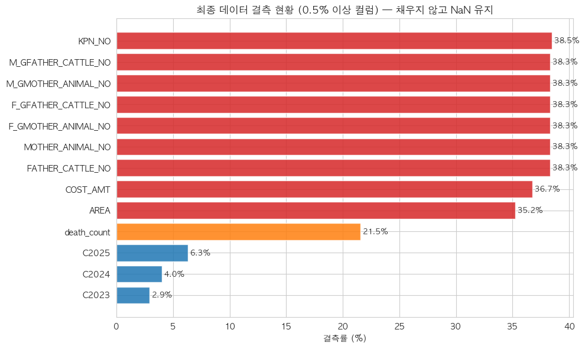
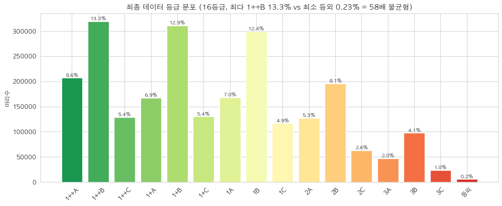

# D2. 데이터 준비 ② — 전처리(빈칸·이상한 값 다듬기)

> **이 강의의 목표**: 합친 데이터는 아직 "날것"입니다. 빈칸(결측), "값 없음"을 뜻하는 코드(-99), 말도 안 되는 값(이상치)이 섞여 있죠. 이걸 **살피고 다듬는 전처리(preprocessing)** 의 원리를 배우고, 우리가 실제로 만든 결측 현황·타깃 분포 그림을 보면서 "이걸 보고 무엇을 결정하는지" 익힙니다.
> **앞 강의**: [D1](D1_테이블병합.md)의 병합·결측 발생, [00-B](00B_우리프로젝트_전체그림.md)의 누수.

---

> 🗺️ **학습 여정**: 기초(00A·00B) → 데이터준비(D1·D2) → EDA(E1·E2·E3) → 〔분류 C1–C7〕 · 〔회귀 R1–R8〕  ·  **📍 지금: 데이터준비 2/2**

---

## 1. 전처리란 — 요리 전 재료 손질

**전처리(preprocessing)** = 데이터를 분석·모델에 넣을 수 있게 **깨끗이 다듬는** 단계입니다.

> 비유: 요리 전 재료 손질. 흙 묻은 채소를 씻고, 상한 부분을 도려내고, 크기를 맞춰 썰죠. 안 하면 요리(분석)가 엉망이 됩니다. 데이터도 똑같습니다 — 빈칸·오류·이상값을 그대로 두면 평균·상관·모델이 전부 오염됩니다.

전처리에서 다루는 세 가지:
1. **결측(빈칸)** — 어디가 왜 비었나
2. **결측 코드(-99)** — "값 없음"을 숫자로 적어둔 것
3. **이상치** — 튀는 값

하나씩, 우리 실제 데이터 그림과 함께 봅시다.

---

## 2. 결측 코드(-99) — 숨은 빈칸 찾기

가장 먼저 할 일입니다. 우리 데이터는 **"값 없음"을 -99라는 숫자로** 기록해 뒀습니다(현장에서 흔한 방식). 문제는, 컴퓨터는 이 -99를 **진짜 숫자 −99로 계산**한다는 것입니다.

```
가격에 -99가 섞여 있으면:
  평균 = (16000 + 17000 + ... + (−99) + (−99)) / 개수
       → 평균이 실제보다 확 낮아짐 (오염!)
```

그래서 전처리 맨 처음에 **-99를 진짜 빈칸(NaN)으로 바꿉니다.** 숫자형 -99와 문자형 "-99"가 섞여 있어 둘 다 처리합니다. 이걸 안 하면 모든 통계가 −99에 끌려 망가집니다.

> 교훈: 데이터를 받으면 **"이 데이터는 결측을 어떻게 표시하나?"** 를 가장 먼저 확인하세요. -99, 0, 공백, "N/A" 등 제각각입니다.

---

## 3. 결측 현황 살피기 — 어느 변수가 얼마나 비었나

-99를 NaN으로 바꾸고 나면, **변수별로 몇 %가 비었는지** 셉니다. 우리 결과가 이 그림입니다.



**그림 읽는 법**: 가로축이 결측률(%), 막대가 길수록 많이 비었습니다. 색은 심각도(빨강 30%↑, 주황 10%↑, 파랑 적음).

**이 그림에서 읽어야 할 것**:
- **혈통 변수(KPN_NO 등) 약 38%** — 가장 많이 빔. 혈통 미등록 개체가 많다는 뜻.
- **가격(COST_AMT) 36.7%** — 거래가 비공개인 소가 많음. → 회귀팀이 "가격 있는 소만" 분석하게 되는 이유([R1](R1_회귀의_목적_인과.md)의 선택 편향).
- **면적(AREA) 35.2%, 폐사(death_count) 21.5%** — 농장 정보 누락.
- **사육두수(C2023~25) 2.9~6.3%** — 비교적 적음.

> **이 그림으로 내리는 결정**: "어느 변수가 결측이 많으니 조심하자", "가격이 37% 비었으니 회귀 결과는 공개 거래 한정이라고 밝히자" 같은 **분석 방향**이 이 한 장에서 나옵니다. EDA·모델링 내내 이 결측률을 의식합니다.

---

## 4. "기록 없음" ≠ "진짜 0" — 결측의 의미

결측에서 가장 중요한 개념입니다([E1](E1_EDA_단변량_분포.md)에서 예고). **빈칸을 함부로 0으로 채우면 안 됩니다.**

- `death_count`(폐사 수)가 비었다면? → 그 농장의 **폐사 기록이 아예 없음(모름)** 이지, **"폐사 0마리"가 아닙니다.**
- 0으로 채우면 "모르는 농장"과 "정말 폐사 없던 농장"이 **뒤섞여** 분석이 오염됩니다.

그래서 우리는 **"왜 비었나"를 변수마다 판단**합니다.

| 변수 | 왜 비었나 | 의미 |
| --- | --- | --- |
| 혈통 | 등록 안 됨 | 미등록 개체 |
| 가격 | 거래 비공개 | "공개된 소만" 봐야 함 |
| death_count | 폐사 기록 없음 | "0건"이 아니라 "모름" |

### 그래서 어떻게 채우나? — 모델에 따라 다름

핵심은 **함부로 안 채운다**입니다. 처리 방식은 [C3](C3_인코딩과_결측_스케일링.md)에서 자세히 배우지만 미리 요약하면:

- **트리 모델(LightGBM 등)**: 빈칸을 **그대로 NaN으로** 둡니다. 트리는 "결측이라는 갈래"로 알아서 처리하니까요. 섣불리 채우면 오히려 왜곡.
- **선형 모델(회귀)**: NaN을 못 먹으니 **학습셋의 중앙값**으로 채웁니다(누수 방지: 학습셋에서만 계산).

> 그래서 우리 전처리 원칙은 **"결측은 일단 NaN으로 정직하게 유지"** 입니다. 그림 제목에도 "채우지 않고 NaN 유지"라고 적혀 있죠.

---

## 5. 이상치 — 튀는 값을 어떻게 볼까

전처리에서 **이상치(outlier, 튀는 값)** 도 살핍니다. describe()의 최소·최대, 히스토그램의 꼬리에서 드러납니다. 우리 데이터에서 발견한 것들:

- **WEIGHT(도체중)에 3kg** 같은 값 — 정상 소가 아님(송아지 폐사 직전 등).
- **AGE(월령)에 300개월(=25년)** 같은 값 — 노폐우([E3](E3_EDA_기상_시공간_파생.md)).
- **AREA·사육두수에 0** — 알고 보니 병합 과정의 버그(전부 NaN인 그룹을 합산하면 0이 되는 pandas 특성). → 발견 즉시 NaN으로 수정.

### 두 종류의 이상치 — 처리가 다르다

| 종류 | 예 | 처리 |
| --- | --- | --- |
| **입력 오류·불가능한 값** | 면적 0(버그), 음수 기온 | 원인 조사 → 수정/NaN |
| **자연 발생 이상치(진짜 특수 개체)** | 노폐우, 초고가 한우 | **함부로 안 지움** (실제 데이터) |

> **우리 원칙: 자연 발생 이상치는 제거하지 않는다.** 이유는 [E1](E1_EDA_단변량_분포.md)에서 본 두 가지 — ① 실제 데이터를 버리면 분석이 현실과 멀어지고, ② 주력 모델인 트리는 이상치에 강합니다("450보다 큰가?"로 쪼개니 극단값 하나가 모델을 못 휘두름). 다만 **입력 오류(면적 0 버그)** 는 반드시 잡습니다.

> 이상치를 "발견하고 원인을 기록"하는 게 전처리의 일이고, 실제 제거 판단은 신중히 합니다(회귀에선 쿡의 거리로 영향력을 따로 점검 — [R7](R7_잔차진단.md)).

---

## 6. 타깃(등급) 살피기 — 불균형의 발견

전처리에서 **타깃(맞히려는 정답)** 도 반드시 봅니다. 우리 등급 분포가 이 그림입니다.



**그림 읽는 법**: 가로축이 16개 등급(왼쪽 1++A 최고 → 오른쪽 등외 최저), 막대 높이가 마리 수.

**이 그림에서 읽어야 할 것**:
- **1++B가 가장 많아 13.3%**, 1+B·1B도 12% 이상 — 중상위 등급에 몰려 있음.
- **등외는 0.2%(5,540마리)뿐** — 극히 드뭄.
- **최다(1++B)와 최소(등외)가 58배** 차이 — 심각한 **불균형**.

> **이 그림으로 내리는 결정 (분류팀에게 결정적)**: 등급이 이렇게 불균형하니 —
> - **정확도를 믿으면 안 된다** → 평가지표를 **Macro-F1**으로([C1](C1_분류문제와_평가지표.md)).
> - **소수 등급에 가중치**를 줘야 한다 → class_weight([C2](C2_데이터분할과_누수.md)).
>
> 분류팀의 핵심 전략 두 개가 이 한 장에서 결정됩니다. **타깃 분포를 먼저 보는 게 그만큼 중요**합니다.

---

## 7. 전처리 검증 — 깨끗해졌는지 확인

다듬은 뒤엔 **"제대로 됐나"를 검증**합니다. 사람 눈 대신 **조건식으로 자동 점검**(PASS/FAIL)합니다. 예:

```
[PASS] -99가 모두 NaN으로 바뀌었나?
[PASS] 행 수가 여전히 2,408,699인가? (전처리가 행을 안 지웠나)
[PASS] 건드리지 않은 컬럼(WEIGHT·AGE)이 원본과 똑같나?
[PASS] 출생일 ≤ 도축일인가? (논리 모순 없나)
[PASS] 면적 0이 사라졌나? (버그 수정 확인)
```

이런 검증을 코드에 박아 두면, 전처리 중 뭔가 깨졌을 때 바로 잡힙니다. 최종 결과는 **2,408,699 × 44**의 깨끗한 테이블(`step6_preprocess.csv`)이고, 이게 EDA([E1](E1_EDA_단변량_분포.md))의 출발점입니다.

---

## 8. 핵심 정리

- **전처리** = 분석 전 재료 손질. 안 하면 통계·모델이 오염된다.
- **결측 코드(-99)** 를 가장 먼저 NaN으로. 안 하면 평균·상관이 −99에 끌려 망가짐.
- **결측 현황 그림**으로 "어느 변수가 얼마나 비었나" 파악 → 분석 방향 결정(가격 37% → 회귀는 공개분 한정).
- **"기록 없음 ≠ 진짜 0"** — 함부로 0으로 안 채움. 트리는 NaN 유지, 선형은 학습셋 중앙값([C3](C3_인코딩과_결측_스케일링.md)).
- **이상치**: 입력 오류(면적 0 버그)는 수정, **자연 발생 이상치(노폐우 등)는 안 지움**(트리가 강함).
- **타깃 분포 그림**으로 불균형(58배) 발견 → Macro-F1·클래스 가중치 결정(분류 핵심).
- 전처리 후 **자동 검증**(PASS/FAIL)으로 깨끗함 확인 → step6_preprocess(240만 × 44).

---

## 스스로 답해보기

> 먼저 스스로 답을 떠올린 뒤 **[정답모음](정답모음.md)** 에서 맞춰 보세요. 바로 보면 기억에 안 남습니다.

1. 가격에 -99가 섞인 채로 평균을 내면 무슨 일이 생기나요? 그래서 전처리 맨 처음에 무엇을 하나요?
2. 결측 현황 그림에서 가격(COST_AMT)이 37% 비었다는 사실은 회귀팀의 어떤 한계로 이어지나요?
3. death_count의 빈칸을 0으로 채우면 안 되는 이유는?
4. "면적 0(버그)"과 "노폐우(월령 300)"는 둘 다 이상치인데, 처리가 어떻게 다른가요?
5. 등급 분포 그림에서 본 58배 불균형은 분류팀의 어떤 두 가지 결정으로 이어지나요?

> 다음 강의 **[E1. EDA ① 단변량(한 변수의 분포)](E1_EDA_단변량_분포.md)** — 깨끗해진 데이터로, 이제 변수 하나하나가 어떻게 생겼는지 본격 탐색합니다.
