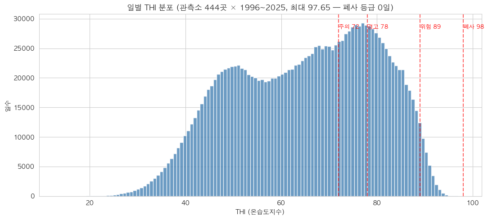

# E1. EDA ① — 한 변수씩 들여다보기 (단변량 분석)

> **이 강의의 목표**: EDA의 **첫 단계**, "변수 하나하나가 어떻게 생겼나"를 보는 법을 배웁니다. 히스토그램으로 분포 모양을 읽고, 평균·중앙값·표준편차·사분위 같은 **기술통계**로 요약하고, 왜도·첨도로 치우침·뾰족함을 재고, 결측(빈칸)·이상치를 살핍니다. 우리 가격이 왜 "로그를 씌워야 하는 분포"인지도 여기서 보입니다.
> **앞 강의**: [D2](D2_전처리.md)의 전처리(깨끗해진 데이터), [00-B](00B_우리프로젝트_전체그림.md)의 데이터 구성.

---

> 🗺️ **학습 여정**: 기초(00A·00B) → 데이터준비(D1·D2) → EDA(E1·E2·E3) → 〔분류 C1–C7〕 · 〔회귀 R1–R8〕  ·  **📍 지금: EDA 1/3**

---

## 1. EDA의 두 단계: 단변량 → 이변량

**EDA(Exploratory Data Analysis, 탐색적 데이터 분석)** 는 모델을 만들기 *전에* 데이터를 들여다보며 친해지는 단계입니다.

> 비유: 처음 가는 동네에서 바로 운전하지 않고, **지도를 펴서 길을 먼저 익히는** 것. 데이터 생김새(분포·관계·이상한 점)를 모르고 모델부터 돌리면 엉뚱한 결과를 그대로 믿게 됩니다.

EDA는 보통 **두 단계**로 진행합니다. 이 순서가 중요합니다.

```
① 단변량(univariate) 분석  →  ② 이변량(bivariate) 분석
  "한 변수가 어떻게 생겼나"      "두 변수가 어떤 관계인가"
   (이 강의 E1)                  (다음 강의 E2)
```

- **단변량**: 변수 *하나씩* 따로 봅니다. 몸무게는 어떻게 퍼져 있나? 가격은 한쪽으로 치우쳤나? 빈칸은 없나?
- **이변량**: 변수 *둘 사이* 관계를 봅니다. 몸무게가 크면 등급도 좋은가?

> 왜 단변량부터? **재료를 하나씩 살펴본 뒤** 조합을 보는 게 순서입니다. 각 변수가 어떻게 생겼는지 모르면, 두 변수 관계도 잘못 읽습니다(예: 치우친 변수는 상관계수가 왜곡됨). 그래서 **한 변수씩 → 두 변수씩** 순으로 갑니다.

이번 강의는 **단변량**입니다.

---

## 2. 히스토그램 — 분포를 눈으로 보는 첫 도구

한 변수가 "어떻게 퍼져 있나"를 보는 가장 기본 그림이 **히스토그램(histogram)** 입니다.

만드는 법: 값의 범위를 여러 칸(구간)으로 나누고, **각 칸에 몇 개가 들어가는지** 막대 높이로 그립니다. 예를 들어 몸무게를 50kg 단위로 나눠 "350~400kg인 소 몇 마리, 400~450kg 몇 마리…"를 막대로.

```
마리수
 │          ▆▆
 │        ▆▆██▆▆
 │      ▆▆██████▆▆        ← 가운데가 가장 많고 양옆으로 줄어듦
 │    ▆▆██████████▆▆        (종 모양 = 정규분포에 가까움)
 │  ▆▆██████████████▆▆
 └──────────────────────── 몸무게
   300  400  500  600
```

막대들이 이루는 **윤곽(모양)** 으로 분포를 읽습니다. 대표적인 세 가지 모양을 알아둡시다.

### 모양 ① 종 모양 (정규분포에 가까움)

```
   ▁▃▅█▅▃▁     가운데가 가장 많고 좌우 대칭으로 줄어듦
```
가장 다루기 쉬운 모양입니다. 평균 근처에 대부분 모여 있고 양극단이 드뭅니다. 키·몸무게 같은 자연스러운 측정값이 흔히 이렇습니다.

### 모양 ② 한쪽으로 치우침 (skewed) — 우리 가격이 이것!

```
오른쪽 꼬리가 긴 분포(우편향):
   █▆▅▃▂▁▁_____    왼쪽에 몰려 있고 오른쪽으로 길게 꼬리
```
대부분 값이 낮은 쪽에 모여 있고, **소수의 큰 값이 오른쪽으로 꼬리를 길게** 끕니다. 우리 **가격(COST_AMT)** 이 정확히 이 모양입니다 — 대부분 1~2만원대인데 일부 비싼 소가 꼬리를 끕니다. (이 치우침이 나중에 "로그를 씌우는 이유"가 됩니다. 5절에서.)

### 모양 ③ 봉우리가 둘 (쌍봉, bimodal) — 숨은 집단 신호!

```
   ▃▅█▅▃  ▃▅█▅▃    봉우리가 두 개 → 서로 다른 두 집단이 섞임
```
봉우리가 두 개면 **성질이 다른 두 집단이 한 변수에 섞여 있다**는 신호입니다. 예: 거세우와 암소의 몸무게를 한 그림에 그리면 봉우리가 둘로 갈릴 수 있습니다(체격이 다르니까). 또 우리 데이터에선 **정상 비육우와 노폐우**(E3에서 자세히)가 섞여 봉우리가 갈릴 수 있죠. 쌍봉을 보면 "성별·집단을 나눠 봐야겠다"는 힌트를 얻습니다.

### 우리 실제 히스토그램 — THI(더위지수) 분포

말로만 하면 안 와닿으니 우리가 실제로 그린 히스토그램을 봅시다. 날씨 데이터의 **THI(온습도지수, 소가 느끼는 더위)** 분포입니다.



**그림 읽는 법**: 가로축이 THI 값(클수록 더움), 세로축이 그 값이 나온 일수(막대 높이). 빨간 점선은 더위 등급 경계(주의 72 / 경고 78 / 위험 89).

**이 그림에서 읽을 것**:
- **봉우리가 둘로 보입니다** — 하나는 THI 50 근처(서늘한 봄·가을·겨울), 하나는 75 근처(더운 여름). 계절이라는 두 집단이 한 변수에 섞인 **쌍봉**의 실제 예입니다.
- 오른쪽 끝(THI 90+)으로 갈수록 일수가 급감 — **위험 등급(89↑)인 날은 드물다**는 뜻. 실제로 폐사 등급(98↑)인 날은 0일이었습니다(제목의 "최대 97.65").
- 이 분포를 보고 "더위 등급별로 며칠씩이었나"를 세어 기상 변수(`days_경고` 등)를 만든 겁니다([E3](E3_EDA_기상_시공간_파생.md)).

> 한 줄: **히스토그램은 "이 변수가 정규인가, 치우쳤나, 두 집단이 섞였나"를 한눈에** 보여줍니다. 실제 THI는 계절이 섞인 쌍봉이었죠.

---

## 3. 기술통계 — 분포를 숫자 몇 개로 요약

그림도 좋지만, 분포를 **숫자 몇 개로 요약**하면 비교·기록이 편합니다. 이걸 **기술통계(descriptive statistics)** 라 합니다. 두 종류로 나뉩니다: **중심**(어디에 모여 있나)과 **퍼짐**(얼마나 흩어졌나).

### 3-1. 중심을 재는 셋: 평균·중앙값·최빈값

- **평균(mean)**: 다 더해서 개수로 나눈 값. 가장 흔하지만 **극단값에 휘둘립니다.**
- **중앙값(median)**: 크기순으로 줄 세웠을 때 **딱 가운데** 값. 극단값에 **안 흔들립니다.**
- **최빈값(mode)**: 가장 자주 나오는 값.

**비유 — 동네 평균 연봉**: 한 동네에 9명이 3천만원, 1명이 100억을 번다면? 평균은 10억이 넘지만(부자 1명에 끌려감), 중앙값은 3천만원(가운데 사람)입니다. **"이 동네 보통 사람"을 말하려면 중앙값**이 맞죠.

> **핵심 활용 — 평균 vs 중앙값으로 치우침 판단**:
> - 평균 ≈ 중앙값 → 분포가 대칭(종 모양).
> - **평균 > 중앙값 → 오른쪽으로 치우침**(큰 값이 평균을 끌어올림). ← 우리 가격이 이것.
> - 평균 < 중앙값 → 왼쪽으로 치우침.
>
> 두 숫자만 비교해도 분포가 치우쳤는지 알 수 있습니다.

### 3-2. 퍼짐을 재는 셋: 표준편차·사분위수·IQR

- **표준편차(standard deviation)**: 값들이 **평균에서 평균적으로 얼마나 떨어져 있나.** 작으면 옹기종기, 크면 넓게 퍼짐. (분산은 표준편차의 제곱 — 같은 개념입니다.)
- **사분위수(quartile)**: 크기순으로 줄 세워 **4등분**한 지점.
  - **Q1**(제1사분위, 하위 25% 지점), **Q2**(중앙값, 50%), **Q3**(제3사분위, 상위 25% 지점).
- **IQR(사분위 범위)** = Q3 − Q1. **가운데 50%가 차지하는 폭.** 양극단을 무시한 "중심부 퍼짐"이라 극단값에 강합니다.

```
   ├──────┼━━━━━┿━━━━━┼──────┤
  최소    Q1   중앙값  Q3    최대
        └─── IQR ───┘  ← 가운데 50%의 폭
```

> IQR이 왜 유용? 표준편차는 극단값에 휘둘리지만, **IQR은 가운데 50%만 보므로 이상치에 안정적**입니다. 그래서 박스플롯(E2)이 IQR을 상자로 그립니다. 또 "Q1 − 1.5×IQR보다 작거나 Q3 + 1.5×IQR보다 큰 값"을 흔히 **이상치 후보**로 봅니다(6절).

### 3-3. 한 번에 보기 — describe()

실무에선 `df.describe()` 한 줄이면 개수·평균·표준편차·최소·Q1·중앙값·Q3·최대가 다 나옵니다. 변수마다 이 표를 훑는 게 단변량 분석의 시작입니다.

---

## 4. 왜도와 첨도 — 치우침과 뾰족함을 숫자로

히스토그램의 "치우쳤다/뾰족하다"를 **숫자로** 재는 두 지표입니다. 이름은 어렵지만 뜻은 단순합니다.

### 왜도(skewness) — 얼마나 치우쳤나

```
왜도 = 0   : 좌우 대칭 (종 모양)
왜도 > 0   : 오른쪽 꼬리가 길다 (우편향) ← 우리 가격!
왜도 < 0   : 왼쪽 꼬리가 길다 (좌편향)
```

[3-1](#)에서 본 "평균 > 중앙값이면 우편향"을 하나의 숫자로 정리한 게 왜도입니다. 양수면 오른쪽 꼬리, 클수록 더 치우침.

### 첨도(kurtosis) — 얼마나 뾰족한가 / 꼬리가 두꺼운가

```
첨도 높음 : 가운데가 뾰족하고 꼬리가 두껍다 (극단값이 정규분포보다 많음)
첨도 낮음 : 펑퍼짐하다
```

첨도는 주로 **"극단값이 얼마나 많은가"** 를 봅니다. 첨도가 높으면 평범한 값 사이에 **극단적으로 크거나 작은 값이 꽤 끼어 있다**는 뜻이라, 이상치를 의심하게 합니다.

### 우리 가격과의 연결 — 회귀에서 로그를 쓰는 이유

우리 **가격은 왜도가 큰(오른쪽 꼬리가 긴) 분포**입니다. 그런데 [R2](R2_선형회귀_기초.md)에서 배울 회귀는 "오차가 종 모양(대칭)"일 때 잘 작동합니다. 치우친 분포를 그대로 쓰면 가정이 안 맞죠.

해결: **로그를 씌웁니다.** 로그는 큰 값을 더 많이 눌러서, **긴 오른쪽 꼬리를 끌어당겨 종 모양에 가깝게** 만듭니다.

```
원래 가격:    █▆▅▃▂▁____   (왜도 큼, 오른쪽 꼬리 김)
로그 가격:    __▂▅█▅▂__    (왜도 작아짐, 종 모양에 가까움)
```

→ 그래서 회귀팀은 `log(가격)`을 타깃으로 씁니다([R2](R2_선형회귀_기초.md)). **단변량 분석에서 "가격이 우편향"임을 발견한 게, 회귀에서 로그를 쓰는 직접적 근거**입니다. EDA가 모델링 결정으로 이어지는 좋은 예죠.

---

## 5. 결측치(빈칸)를 EDA 관점에서 살피기

단변량 분석에서 **빈칸(결측, NaN)** 도 꼭 봅니다. "어느 변수가 몇 % 비었나"를 세는 거죠. 우리 데이터의 결측 현황:


**그림 읽는 법**: 가로축이 결측률(%), 막대가 길수록 많이 비었습니다(빨강 30%↑, 주황 10%↑, 파랑 적음). 혈통 약 38%, 가격 36.7%, 면적 35.2%, 폐사 21.5%, 사육두수 2.9~6.3%. 이 그림 한 장으로 "어느 변수가 위험한지"를 한눈에 파악합니다. (전처리에서 자세히 — [D2](D2_전처리.md))

### "기록 없음" ≠ "진짜 0" (가장 중요)

빈칸을 다룰 때 핵심 질문은 **"왜 비었나"** 입니다. 특히 **"기록이 없어서 빈 것"과 "값이 진짜 0인 것"은 전혀 다릅니다.**

- 예: `death_count`(폐사 수)가 비어 있다면? → 그 농장의 **폐사 기록이 아예 없는 것**(모름)이지, **"폐사 0마리"** 가 아닙니다.
- 만약 빈칸을 0으로 채우면? "모르는 농장"과 "정말 폐사가 없던 농장"이 **뒤섞여** 버립니다. 분석이 오염되죠.

> 그래서 EDA 단계에선 **"이 빈칸이 무슨 의미인지"** 를 변수마다 판단하고 기록해 둡니다. 실제로 채우거나 비우는 **처리**는 [C3](C3_인코딩과_결측_스케일링.md)에서 합니다(트리 모델은 빈칸을 그대로 먹고, 선형 모델은 학습셋 중앙값으로 채움). EDA의 일은 **"어디가 왜 비었는지 파악"** 까지입니다.

---

## 6. 이상치(튀는 값)를 EDA 관점에서 살피기

**이상치(outlier)** = 다른 값들과 동떨어진 튀는 값. 히스토그램의 꼬리, 박스플롯의 바깥 점(E2), describe()의 min/max에서 드러납니다.

### 이상치를 발견하면? — 함부로 지우지 않는다 (우리 원칙)

초보가 자주 하는 실수: "튀니까 일단 지우자." **위험합니다.** 이상치엔 두 종류가 있습니다.

- **입력 오류·물리적으로 불가능한 값**: 예) 몸무게 3kg인 소, 음수 기온. → 데이터 문제일 수 있어 검토.
- **자연 발생 이상치 (진짜 특수한 개체)**: 예) 초고가 한우, 노폐우. → **실제로 존재하는 소**입니다. 지우면 진짜 정보를 버리는 것.

> **우리 원칙: 자연 발생 이상치는 함부로 제거하지 않는다.** 두 가지 이유가 있습니다.
> 1. 실제 데이터를 버리면 분석이 현실과 멀어집니다.
> 2. 우리 주력 모델인 **트리 모델(LightGBM 등)은 이상치에 강합니다**([C4](C4_분류모델_4종.md)) — "450보다 큰가?"로 쪼개기만 하므로 극단값 하나가 모델을 휘두르지 못합니다.

그래서 EDA에선 이상치를 **"발견하고 원인을 기록"** 하되, 제거는 신중히 합니다(회귀에선 쿡의 거리로 영향력을 따로 점검 — [R7](R7_잔차진단.md)). 이상치 처리도 [C3](C3_인코딩과_결측_스케일링.md)와 연결됩니다.

> 노폐우(아주 늙은 소)는 "이상치이자 숨은 집단"의 대표 사례입니다 — 지우는 게 아니라 **별도 집단으로 인지**합니다(E3에서).

---

## 7. 핵심 정리

- EDA는 **단변량(한 변수씩) → 이변량(두 변수 관계)** 순서. 이 강의는 단변량.
- **히스토그램**으로 분포 모양: 종 모양(정규) / 치우침(skewed) / 쌍봉(숨은 집단).
- **기술통계**: 중심(평균·중앙값·최빈값) + 퍼짐(표준편차·사분위 Q1/Q3·IQR). **평균>중앙값이면 우편향.**
- **왜도**(치우침)·**첨도**(뾰족함·두꺼운 꼬리). 우리 가격은 왜도 큰 우편향 → **회귀에서 로그를 쓰는 근거**.
- **결측**: "기록 없음 ≠ 진짜 0". 의미를 파악해 기록(처리는 C3).
- **이상치**: 자연 발생 이상치는 **함부로 안 지움**(트리 모델이 강함). 발견·기록까지가 EDA의 일.

---

## 스스로 답해보기

> 먼저 스스로 답을 떠올린 뒤 **[정답모음](정답모음.md)** 에서 맞춰 보세요. 바로 보면 기억에 안 남습니다.

1. EDA의 두 단계는 무엇이고, 왜 단변량을 먼저 하나요?
2. 어떤 변수의 평균이 중앙값보다 한참 크다면 분포 모양은 어느 쪽으로 치우친 건가요? 우리 데이터에서 그런 변수는?
3. 표준편차 대신 IQR을 쓰면 좋은 점은 무엇인가요?
4. 우리 가격의 왜도가 크다는 사실이 회귀의 어떤 결정으로 이어지나요?
5. death_count가 빈 농장을 0으로 채우면 안 되는 이유는?
6. "튀는 값(이상치)"을 발견해도 함부로 안 지우는 이유 두 가지는?

> 다음 강의 **[E2. EDA ② — 두 변수의 관계: 상관과 시각화](E2_EDA_상관과_시각화.md)** — 두 변수가 같이 움직이는지(상관), 관계를 눈으로 보는 법(산점도·박스플롯), 차이가 진짜인지 따지는 검정(p값 포함).


> 📊 **우리 실제 결과 그림을 다 보고 싶다면** → [E4. 우리 결과 전수 해설집](E4_우리결과_전수해설.md) (23개 그림 전부 해설)
