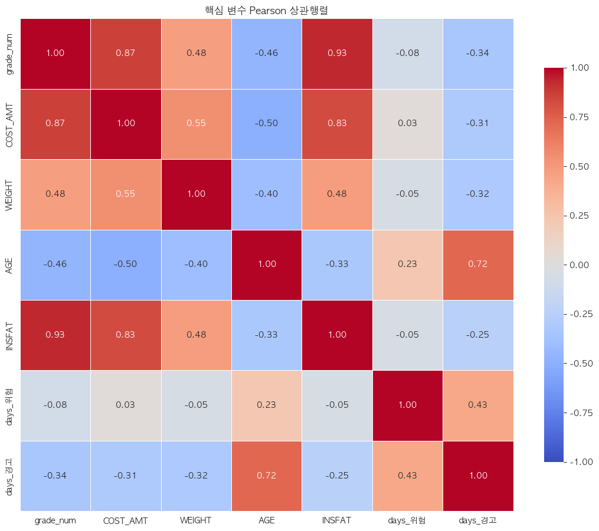
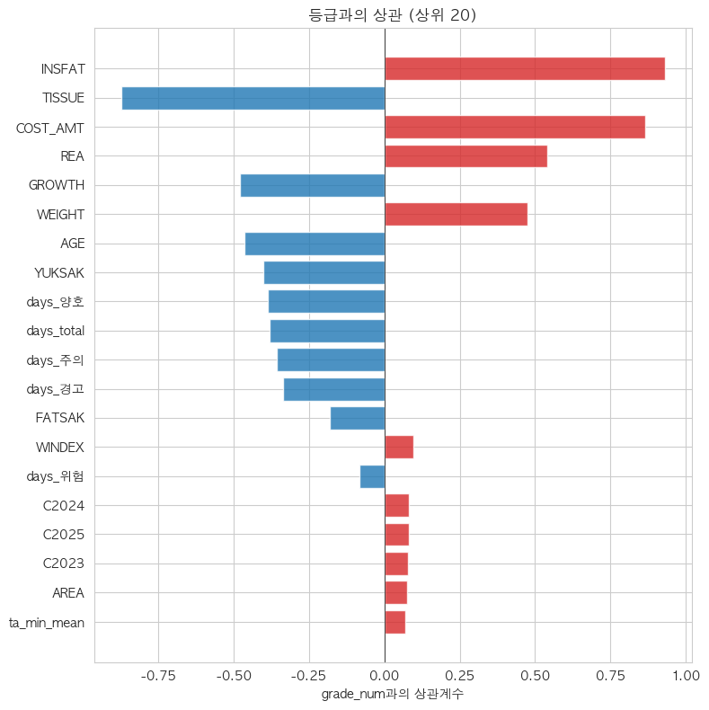
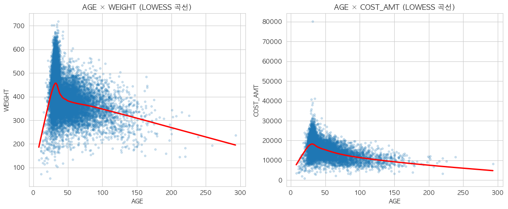
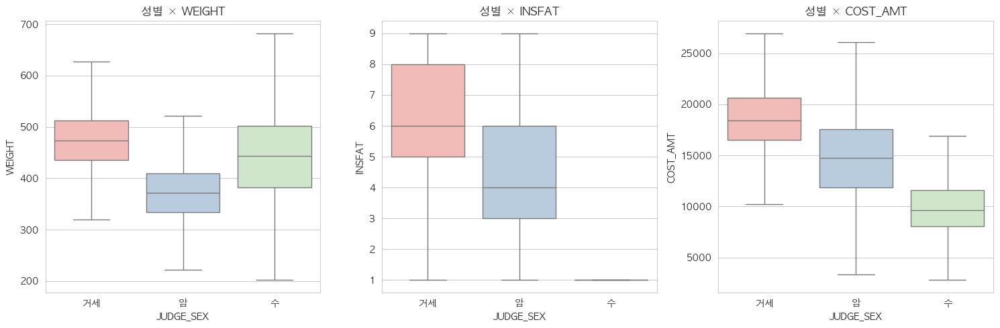

# E2. EDA ② — 두 변수의 관계: 상관과 시각화

> **이 강의의 목표**: [E1](E1_EDA_단변량_분포.md)에서 변수를 *하나씩* 봤다면, 이번엔 변수 *둘 사이의 관계*를 봅니다(이변량 분석). 같이 움직이는 정도(상관계수, Pearson·Spearman), 관계를 눈으로 보는 법(산점도·LOWESS·박스플롯), 그리고 그룹 차이가 진짜인지 따지는 통계 검정(p값 정의 포함)까지. 우리 13~14회차입니다.
> **앞 강의**: [E1](E1_EDA_단변량_분포.md)의 분포·기술통계·이상치, [00-B](00B_우리프로젝트_전체그림.md)의 데이터 구성.


> 🗺️ **학습 여정**: 기초(00A·00B) → 데이터준비(D1·D2) → EDA(E1·E2·E3) → 〔분류 C1–C7〕 · 〔회귀 R1–R8〕  ·  **📍 지금: EDA 2/3**

---

## 1. 단변량에서 이변량으로

[E1](E1_EDA_단변량_분포.md)에서 변수를 **하나씩** 살펴봤습니다(분포·치우침·결측·이상치). 이제 한 걸음 더 나아가 **두 변수의 관계**를 봅니다.

```
E1: "몸무게는 어떻게 퍼져 있나?"   (한 변수)
E2: "몸무게가 크면 등급도 좋은가?"  (두 변수 관계) ← 이 강의
```

이걸 **이변량(bivariate) 분석**이라 합니다. 핵심 질문은 늘 같습니다 — **"이 변수와 저 변수는 같이 움직이나, 무관한가?"** 그리고 특히 **"타깃(등급·가격)과 친한 변수는 무엇인가?"** 친한 변수가 좋은 피처 후보니까요.

> **우리 프로젝트의 위치**: 13~17회차가 EDA였고, 그 결과로 **피처 92개**가 만들어졌습니다. E1~E3는 "그 92개가 어디서 왔는지"를 보여줍니다. 이 강의(E2)는 변수 관계 탐색입니다.

---

## 2. 상관계수 — 두 변수가 같이 움직이는 정도

가장 먼저 쓰는 도구입니다. **상관계수(correlation)** 는 두 변수가 **얼마나 같이 움직이는지**를 −1 ~ +1 숫자 하나로 요약합니다.

```
+1에 가까움 : 한쪽이 커지면 다른 쪽도 커진다 (예: 키 ↑ → 몸무게 ↑)
 0에 가까움 : 둘이 서로 무관하게 움직인다
−1에 가까움 : 한쪽이 커지면 다른 쪽은 작아진다 (예: 운동량 ↑ → 체지방 ↓)
```

### 강도 읽는 법

| \|상관\| | 강도 | 느낌 |
| --- | --- | --- |
| 0.0 ~ 0.2 | 거의 무관 | 신경 안 써도 됨 |
| 0.2 ~ 0.4 | 약함 | 참고만 |
| 0.4 ~ 0.7 | 중간 | 쓸 만한 관계 |
| 0.7 ~ 1.0 | 강함 | 매우 밀접 (주의: 변수끼리면 다중공선성) |

### 히트맵으로 한눈에

변수가 많으면 상관을 표로 만들고 **색칠(히트맵)** 합니다. 빨강=양의 상관, 파랑=음의 상관, 흰색=무관. 어느 변수끼리 밀접한지 한 장으로 보입니다. 우리가 실제로 그린 핵심 변수 히트맵입니다.



**그림 읽는 법**: 가로·세로에 같은 변수들이 놓이고, 칸 색이 두 변수의 상관입니다(대각선은 자기 자신이라 항상 1). **진한 빨강 칸**(예: grade_num↔INSFAT, COST_AMT↔grade_num)이 "강하게 같이 움직이는 쌍"입니다. 이 그림으로 "어떤 변수가 등급·가격과 친한지", "어떤 변수끼리 닮았는지(다중공선성 후보)"를 한눈에 찾습니다.

> **주의 (큰 표본의 함정)**: 우리는 240만 행이라 상관 0.02 같은 아주 약한 관계도 "통계적으로 유의"하게 나옵니다. 그래서 **상관의 크기(절댓값)** 로 판단하지, "유의하다"는 말에 속으면 안 됩니다. (이 함정은 [C1](C1_분류문제와_평가지표.md)·R 트랙에서 계속 만납니다.)

---

## 2.5 상관계수의 두 종류 — Pearson vs Spearman

사실 상관계수는 한 종류가 아닙니다. 우리 13회차에서 **두 가지**를 같이 썼고, 그 차이가 중요한 발견으로 이어졌습니다.

### Pearson — "직선으로 얼마나 같이 가나"

지금까지 말한 게 **Pearson(피어슨) 상관계수**입니다. 두 변수가 **직선 관계**로 얼마나 함께 움직이는지를 잽니다. 가장 흔히 쓰지만, **약점이 하나** 있습니다 — **곡선 관계를 못 잡습니다.**

예를 들어 "월령이 늘수록 도체중이 늘지만, 어느 시점부터 증가가 둔해지는"(휘어지는) 관계라면? 분명히 관계가 있는데도 Pearson은 낮게 나올 수 있습니다. 직선이 아니니까요.

### Spearman — "순위로 보면 같이 가나"

**Spearman(스피어만) 상관계수**는 값을 **순위(등수)로 바꿔서** 계산합니다. "A가 클 때 B도 큰가"를 **순서만** 보는 거죠. 그래서 **곡선이어도 "꾸준히 늘기만/줄기만" 하면 높게** 잡아냅니다(단조 관계라고 합니다). 이상치에도 덜 흔들립니다.

```
관계 모양               Pearson    Spearman
─────────────────────────────────────────
완벽한 직선 ↗            높음        높음
휘지만 계속 증가(곡선)    중간        높음 ← 차이!
들쭉날쭉(관계 없음)       낮음        낮음
```

### 둘을 비교하면 곡선 관계가 보인다 (실전 활용)

핵심 활용법: **Pearson과 Spearman을 둘 다 계산해서 비교**합니다.

> **두 값이 많이 다르면 → "직선이 아닌 곡선 관계"를 의심** → 산점도로 확인 → 필요하면 **제곱항**을 만든다.

13회차에서 정확히 이걸 했습니다. **월령(AGE)과 등급**의 Pearson·Spearman이 꽤 달랐는데, 이게 "관계가 직선이 아니다(곡선이다)"라는 신호였습니다. 산점도·LOWESS(아래 5절)로 휘는 걸 확인했고, 결국 17회차에서 **Age_squared(월령²)** 라는 제곱항 변수를 만든 근거가 됐습니다.

> 한 줄: **Pearson은 직선, Spearman은 순위(곡선도 OK). 둘이 다르면 곡선 관계 의심 → 제곱항.** 이게 EDA가 파생변수로 이어진 실제 사례입니다.

---

## 3. 13회차에서 상관으로 알아낸 것 (실제 결과)

상관 분석으로 우리는 세 가지 중요한 걸 발견했습니다. 전부 모델링에 직결됩니다.

### 발견 ① 육질 변수는 등급과 거의 한 몸 (= 누수 신호)

근내지방도·등심단면적·조직감 같은 **육질 변수가 등급과 상관 0.87 이상**이었습니다. 거의 같은 값이라는 뜻이죠. [00-B](00B_우리프로젝트_전체그림.md)에서 배운 대로, 이건 발견이 아니라 **정의**입니다(육질로 등급을 매기니까). 그래서 이 변수들은 **분류 피처에서 제외**합니다(누수).

### 발견 ② daily_gain·WEIGHT는 등급과 친한 "좋은 재료"

- **daily_gain** 이 등급과 상관 **+0.522** — 우리가 만든 파생변수 중 등급과 가장 친합니다.
- **WEIGHT(도체중)** 가 등급과 **+0.475**.

둘 다 test에서 계산 가능해([00-B](00B_우리프로젝트_전체그림.md)) **분류의 핵심 피처**가 됩니다.

> **용어 정확히**: daily_gain은 흔히 "하루 증체량"이라 부르지만, 우리 데이터에선 **도체중 ÷ 전체 사육일수**로 계산합니다. 즉 정확히는 **"생애 하루당 도체중"**(생애 평균 성장 효율)이고, 축산에서 말하는 진짜 일당증체량(특정 기간 체중 증가÷일수)과는 다릅니다. 의미는 "잘 큰 소일수록 큰 값"으로 같지만, 이름에 속지 말 것.

### 발견 ③ "일수 함정" — 닮은 변수끼리 조심

월령(AGE)과 사육일수, 더위 일수(days_*)들끼리 상관이 높았습니다. 특히 **사육 기간이 긴 소(노폐우)는 모든 "일수" 변수가 다 큽니다.** 그러면 "더위를 많이 겪었다"가 아니라 그냥 "오래 살았다"는 뜻일 수 있죠. → 그래서 15회차에서 일수를 **비율**로 바꿉니다(E3에서). 이렇게 변수끼리 너무 닮은 문제(다중공선성)는 R 트랙 [R3](R3_다중공선성_VIF.md)에서 깊이 배웁니다.

우리가 실제로 그린 "등급과의 상관 순위" 그림에 세 발견이 다 들어 있습니다.



**그림 읽는 법**: 각 막대가 "그 변수와 등급(grade_num)의 상관"입니다. **빨강=양(+)**, **파랑=음(−)**, 막대가 길수록 강한 관계.

**이 그림에서 읽을 것**:
- **INSFAT(근내지방) +0.93, COST_AMT(가격) +0.87, TISSUE(조직감) −0.87** 등 맨 위 = **육질·가격 = "정의"라서 강함 → 분류 제외(누수)**.
- **REA +0.54, WEIGHT +0.48** = 체격 변수, 중간 강도의 **좋은 재료**(daily_gain은 파생이라 이 그림 이후 계산).
- **AGE −0.47, days_양호·days_total 등 −0.38** = 음의 상관. 일수 변수들이 "오래 산 소" 효과로 음수 — **일수 함정**의 흔적.

> 한 줄: 상관 분석이 **"쓸 변수(daily_gain·WEIGHT), 뺄 변수(육질·가격), 조심할 변수(일수)"** 를 미리 골라줬습니다. 이 한 그림이 분류·회귀의 피처 선택 출발점입니다.

---

## 4. 상관계수의 한계 → 그림이 필요하다

상관계수는 **숫자 하나**라 편하지만, 두 가지를 놓칩니다.

1. **곡선 관계**를 못 봅니다. 상관계수는 "직선으로 얼마나 같이 가나"만 재서, U자처럼 휘어진 관계는 0에 가깝게 나옵니다(관계가 있는데도!).
2. **숨은 집단·이상치**를 못 봅니다. 평균적으로는 무관해 보여도, 두 덩어리로 갈려 있을 수 있죠.

그래서 **그림**으로 직접 봐야 합니다. 14회차에서 한 일입니다.

---

## 5. 산점도 — 점 구름으로 관계 보기

**산점도(scatter plot)**: 점 하나가 소 한 마리. 가로축·세로축에 두 변수를 놓고 점을 찍습니다. 점들이 이루는 **모양**으로 관계를 읽습니다.

```
우상향 직선 모양  → 강한 양의 관계
흩어진 구름       → 무관
U자/포물선        → 곡선 관계 (상관계수가 못 잡는 것!)
두 덩어리         → 숨은 집단 있음
혼자 멀리 떨어진 점 → 이상치
```

> 우리는 240만 점을 다 찍으면 화면이 새까매지므로 **2만 개만 샘플링**해서 그렸습니다(관계의 모양만 보면 되니까).

### LOWESS — 점 구름에 부드러운 곡선 긋기

**LOWESS**는 점 구름 사이로 **매끄러운 곡선**을 그어주는 도구입니다. 이 곡선이 직선이면 "직선 관계", 휘어 있으면 "곡선 관계"입니다. 상관계수가 못 보는 비선형을 눈으로 확인하는 도구죠. 우리가 실제로 그린 **월령(AGE) × 도체중·가격** 그림입니다.



**그림 읽는 법**: 파란 점이 소(2만 마리 샘플), **빨간 선이 LOWESS 곡선**입니다.

**이 그림에서 읽을 것**:
- 빨간 곡선이 **직선이 아닙니다** — 월령 30개월쯤까지 급상승했다가, 그 뒤로는 완만히 **내려갑니다**(뒤집힌 형태). "어릴 땐 클수록 무겁지만, 너무 늙으면 오히려 줄어드는" 곡선 관계죠.
- 이 **휘어짐**이 바로 "직선(Pearson)으로는 못 잡는 관계"이고, Pearson·Spearman이 달랐던 이유입니다. → 그래서 **월령²(Age_squared)** 제곱항을 만들어 이 곡선을 모델이 표현하게 했습니다([E3](E3_EDA_기상_시공간_파생.md)).
- 오른쪽으로 월령 200~300(=17~25년)까지 뻗은 점들 = **노폐우**(자연 발생 이상치, [E1](E1_EDA_단변량_분포.md)).

> 한 줄: **LOWESS 곡선이 휘면 → 곡선 관계 → 제곱항.** 이 그림이 Age_squared의 직접 근거입니다.

---

## 6. 박스플롯 — 그룹별로 비교하기

**박스플롯(box plot)** 은 **그룹별 분포를 나란히** 비교하는 데 최고입니다. 상자 하나가 한 그룹(예: 한 등급, 한 지역)의 분포를 요약합니다.

```
   ─┬─   ← 위 수염 (정상 범위 위쪽 끝)
  ┌─┴─┐  ← 상자 위 = 상위 25% 지점(Q3)
  │ ━ │  ← 상자 안 선 = 중앙값(가운데 값)
  └─┬─┘  ← 상자 아래 = 하위 25% 지점(Q1)
   ─┴─   ← 아래 수염
    ·    ← 바깥 점 = 이상치
```

여러 그룹의 상자를 나란히 놓으면, **그룹마다 값이 어떻게 다른지** 한눈에 보입니다. 우리가 실제로 그린 **성별(거세/암/수)별** 박스플롯입니다.



**그림 읽는 법**: 상자 셋이 거세·암·수, 세 패널이 각각 도체중·근내지방(INSFAT)·가격(COST_AMT).

**이 그림에서 읽을 것**:
- **도체중**: 거세 중앙값(상자 안 선) ≈ 473kg > 수 443 > 암 372. 상자가 **뚜렷이 어긋나** 있죠 → 성별이 체격을 크게 가릅니다.
- **근내지방·가격**도 거세 > 암 > 수 순으로 상자가 계단처럼 내려감 → 거세우가 마블링·가격에서 우수.
- 상자들이 이렇게 **확연히 어긋나면** "성별은 강력한 변수"라는 뜻 → 모델에 반드시 넣습니다.

> 한 줄: **박스플롯은 "그룹마다 분포가 얼마나 다른가"를 보여줍니다.** 상자가 계단처럼 어긋날수록 그 그룹 변수가 중요합니다. (이 차이가 우연이 아닌지는 7절 검정으로 확인.)

---

## 7. 통계 검정 — "이 차이가 진짜인가?"

박스플롯에서 그룹 간 차이가 보여도, **"우연히 그렇게 보이는 건 아닐까?"** 를 따져야 합니다. 이때 쓰는 게 **통계 검정**입니다. 그 결과로 나오는 **p값** 부터 정의하고 시작합시다(앞으로 계속 나옵니다).

### p값이란 무엇인가 (처음 보는 사람을 위해)

> **p값(p-value)** = **"실제로는 차이가 없는데도, 순전히 우연으로 이 정도 차이가 관측될 확률."**

천천히 곱씹어 봅시다. 우리가 "거세우와 암소의 몸무게가 다르다"는 걸 봤습니다. 그런데 만약 **진짜로는 차이가 없는데** 우연히 표본을 잘못 뽑아서 그렇게 보인 거라면? p값은 바로 그 **"우연일 확률"** 입니다.

- **p값이 작다**(예: 0.001) → "차이가 없는데 우연히 이렇게 보일 확률이 0.1%밖에 안 된다" → **우연으로 보기 어렵다 → 진짜 차이가 있다고 결론.**
- **p값이 크다**(예: 0.4) → "그냥 우연일 수도 있다" → 차이가 있다고 말 못 함.

보통 **0.05(5%)** 를 기준선으로, p < 0.05면 "통계적으로 유의하다(우연 아니다)"고 합니다.

> 비유: 동전을 10번 던져 앞면이 7번 나왔다고 합시다. "이 동전은 앞면이 잘 나온다"고 할 수 있을까요? p값은 "**공정한 동전인데도** 우연히 7번 이상 앞면이 나올 확률"입니다. 그게 작으면 "이 동전 좀 이상한데?"라고 의심하는 거죠. 크면 "그 정도는 우연히도 나와"가 됩니다.

> **⚠️ 미리 경고하는 함정 — 큰 표본에선 p값이 무조건 작아진다.** p값은 표본이 클수록 작아집니다. 데이터가 많으면 **아주 사소한 차이도** "우연 아님(p<0.05)"으로 잡아냅니다. 우리는 240만 행이라 거의 모든 게 p<0.0001로 나옵니다. 그래서 **p값(차이의 유무)** 만 보면 안 되고, **차이의 크기**(중앙값이 실제로 얼마나 벌어졌나)를 꼭 같이 봐야 합니다. 이 함정은 [C1](C1_분류문제와_평가지표.md)·R 트랙([R5](R5_계수해석_한계효과.md))에서 계속 만납니다.

### 비모수 검정을 쓴 이유

보통 그룹 평균 비교는 ANOVA·t검정을 쓰는데, 이들은 **데이터가 정규분포(종 모양)** 라고 가정합니다. 우리 데이터는 240만 건에 분포가 치우쳐 있어 그 가정이 안 맞습니다. 그래서 **순위로 비교하는 비모수 검정**을 씁니다.

- **Kruskal-Wallis 검정**: 그룹이 **3개 이상**일 때(성별 3종, 등급 16종, 계절 4종). 모든 값을 순위로 바꿔 "그룹별 순위가 고르게 섞였나"를 봅니다.
- **Mann-Whitney U 검정**: 그룹이 **2개**일 때(더위 많은 소 vs 적은 소). Kruskal-Wallis의 2그룹 버전.

검정 결과 **p값이 작으면**(< 0.05) "이 차이는 우연이 아니다"라고 결론.

### 14회차의 실제 결과

- **성별 × 도체중**: Kruskal-Wallis 통계량이 매우 큼(p<0.0001). 거세우(중앙값 473kg)·암소(372kg) 차이가 확실 → **성별은 반드시 넣을 변수**.
- **등급 × 도체중**: 유의 → WEIGHT가 등급 예측에 유용함을 재확인.

> **또 큰 표본의 함정**: 240만 행에선 사소한 차이도 p<0.05로 나옵니다. 그래서 **p값보다 "상자가 실제로 얼마나 벌어졌나"(중앙값 차이)** 를 봅니다. p값은 "차이가 있다/없다"만, 크기는 박스플롯으로.

---

## 8. 핵심 정리

- **이변량 분석** = 두 변수의 관계 보기(E1 단변량 다음 단계). 핵심은 "타깃과 친한 변수 찾기".
- **상관계수**(−1~+1) = 두 변수가 같이 움직이는 정도. 크기(절댓값)로 판단, 큰 표본에선 유의성 말고 크기.
- **Pearson(직선) vs Spearman(순위·곡선도 OK)** — 둘이 다르면 **곡선 관계 의심 → 제곱항**(Age_squared의 근거).
- 13회차 상관이 골라준 것: **육질=누수(제외)**, **daily_gain·WEIGHT=좋은 재료**, **일수=조심(비율로)**.
- 상관계수는 **곡선·숨은 집단을 못 봄** → **산점도**(+LOWESS 곡선)·**박스플롯**으로 눈 확인.
- **p값** = "차이가 없는데 우연히 이만큼 차이 날 확률"(작으면 우연 아님). **큰 표본에선 무조건 작아지므로** p값보다 차이 크기.
- **검정**: Kruskal-Wallis(3그룹+)·Mann-Whitney(2그룹), 정규분포 가정 없는 비모수.

---

## 스스로 답해보기

> 먼저 스스로 답을 떠올린 뒤 **[정답모음](정답모음.md)** 에서 맞춰 보세요. 바로 보면 기억에 안 남습니다.

1. 단변량(E1)과 이변량(E2)의 차이를 한 문장씩 말해 보세요.
2. 육질 변수가 등급과 상관 0.9인데, 이게 "발견"이 아니라 "정의"인 이유는?
3. Pearson과 Spearman이 많이 다르면 무엇을 의심하고, 어떤 변수를 만들게 되나요?
4. p값이 작다는 건 정확히 무슨 뜻인가요? 240만 행에서 p값만 믿으면 안 되는 이유는?
5. 그룹이 3개(성별)일 때와 2개(더위 많음/적음)일 때 각각 어떤 검정을 쓰나요?

> 다음 강의 **[E3. EDA ③ — 기상·시공간·파생변수](E3_EDA_기상_시공간_파생.md)** — 더위 변수는 어떻게 만들고, "더위 많은 소가 등급 좋다"는 이상한 결과의 정체는 무엇이며, 피처 92개가 어떻게 완성됐는지.


> 📊 **우리 실제 결과 그림을 다 보고 싶다면** → [E4. 우리 결과 전수 해설집](E4_우리결과_전수해설.md) (23개 그림 전부 해설)
