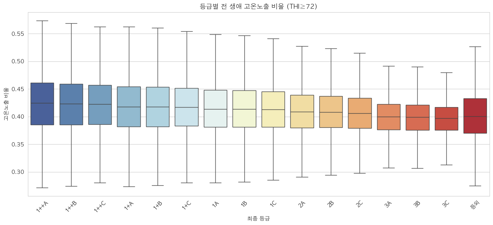
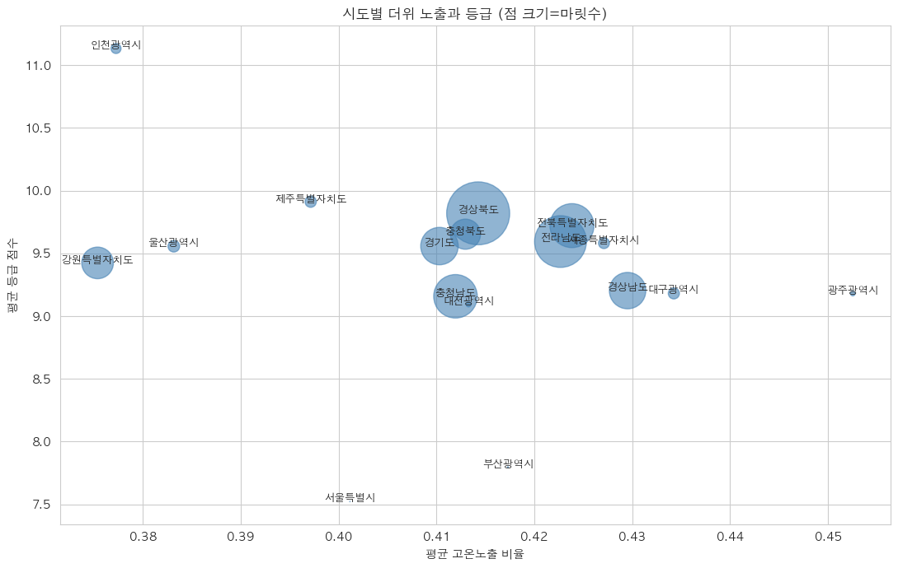
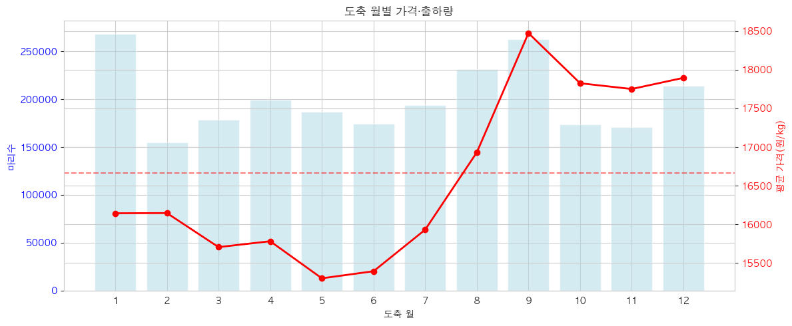
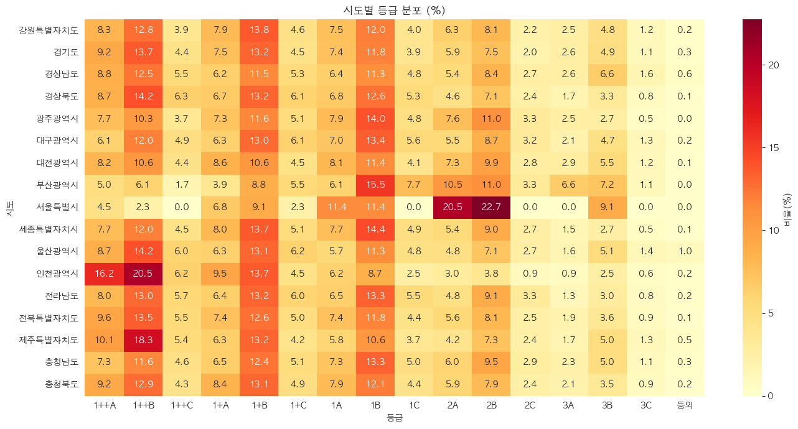

# E3. EDA ③ — 기상·시공간·파생변수 (피처 92개의 탄생)

> **이 강의의 목표**: 대회 주제인 **더위(기상)** 를 변수로 만드는 법, "더위 많은 소가 등급 좋다"는 황당한 결과의 정체(교란), 시간·지역 패턴, 그리고 **원본 변수에서 새 피처를 만들어내는(파생변수)** 과정을 배웁니다. 이 강의가 끝나면 모델에 들어가는 **피처 92개가 어디서 왔는지** 전부 이해됩니다. 우리 15~17회차입니다.
> **앞 강의**: [E2](E2_EDA_상관과_시각화.md)의 상관·일수 함정·검정, [00-B](00B_우리프로젝트_전체그림.md)의 상관≠인과.


> 🗺️ **학습 여정**: 기초(00A·00B) → 데이터준비(D1·D2) → EDA(E1·E2·E3) → 〔분류 C1–C7〕 · 〔회귀 R1–R8〕  ·  **📍 지금: EDA 3/3**

---

## 1. 더위를 어떻게 숫자로 만드나 — THI

대회 주제가 "날씨가 한우에 주는 영향"이니, 먼저 **더위**를 변수로 만들어야 합니다. 그냥 기온만 보면 안 됩니다 — 소는 **습할 때 더 힘들어**하기 때문입니다(땀 대신 호흡으로 열을 식히는데 습하면 잘 안 됨).

그래서 기온과 습도를 합친 **THI(온습도지수, Temperature-Humidity Index)** 를 씁니다. **우리 코드(`Step4-3_weather`)가 실제로 계산한 공식 그대로**입니다(국립축산과학원 NRC 1971 기준).

```
THI = (1.8 × ta_max + 32) − (0.55 − 0.0055 × rhm_avg) × (1.8 × ta_max − 26.8)

  입력: ta_max  = 그날의 일 최고기온(℃)
        rhm_avg = 그날의 일 평균 상대습도(%)
```

> **공식 디테일 (정확성 주의)**: 표준 NRC 1971을 인용한 자료마다 끝항이 `(1.8T − 26)` 또는 `(1.8T − 26.8)`로 갈리는데, **우리 데이터는 `−26.8`** 로 계산했습니다. 임계값(72/78/89) 근처에선 이 작은 차이가 "주의냐 경고냐" 분류를 바꿀 수 있으므로, **강의·보고서는 반드시 코드와 같은 `−26.8`** 을 씁니다. 공식을 외울 필요는 없고 **"기온+습도로 소가 느끼는 더위를 한 숫자로"** 만 기억하면 됩니다.

THI를 등급으로 나눕니다(코드의 `thi_grade` 함수 그대로).

| THI 구간 | 등급 | 의미 |
| --- | --- | --- |
| THI < 72 | 양호 | 쾌적 |
| 72 ≤ THI < 78 | 주의 | 경증 더위 |
| 78 ≤ THI < 89 | 경고 | 중증 — 사료 섭취 감소 |
| 89 ≤ THI < 98 | 위험 | 심각 |
| THI ≥ 98 | 폐사 | (우리 기간엔 발생 안 함) |

각 소가 **태어나서 도축될 때까지** 며칠을 각 등급에서 보냈는지(days_양호·주의·경고·위험)를 세어 둡니다.

---

## 2. 왜 "일수"가 아니라 "비율"인가 (E2의 일수 함정 해결)

[E2](E2_EDA_상관과_시각화.md)에서 본 **일수 함정**을 기억하세요. 사육 기간이 소마다 다릅니다(2년 vs 10년). 그냥 "더운 날 50일"이라고 하면 **오래 산 소가 무조건 많겠죠.** "더위를 많이 겪음"과 "그냥 오래 삶"이 뒤섞입니다.

해결: **비율**로 바꿉니다.

```
ratio_고온 = (주의 + 경고 + 위험 일수) / 전체 사육일수
```

이러면 "사육 기간 대비 며칠을 더위에 시달렸나"라는 **공정한 비교**가 됩니다. 10년 산 소든 2년 산 소든 "생애의 몇 %가 더웠나"로 같은 잣대에 놓이죠. (실제 ratio_고온 평균은 0.415 — 한우는 생애의 약 41%를 주의 이상 더위에서 보냅니다.)

> 이게 [E2](E2_EDA_상관과_시각화.md)에서 예고한 "일수를 비율로 바꾼다"입니다. 변수를 **의미 있게 가공**하는 게 다음 주제인 파생변수의 핵심입니다.

---

## 3. 충격적 결과: "더위 많은 소가 등급이 좋다" — 그리고 함정

더위 비율과 등급의 관계를 봤더니 **황당한 결과**가 나왔습니다. 우리가 실제로 그린 **등급별 더위 노출** 박스플롯을 보세요.



**그림 읽는 법**: 가로축이 등급(왼쪽 1++A 최고 → 오른쪽 등외), 세로축이 그 등급 소들의 더위 노출 비율. 색이 파랑(좋은 등급)→빨강(나쁜 등급).

**이 그림에서 읽을 것**:
- **왼쪽(좋은 등급)일수록 상자가 위(더위 노출 ↑)** 에 있습니다. 1++A 중앙값 ≈ 0.425, 등외 ≈ 0.40.
- 즉 **좋은 등급 소가 오히려 더위를 더 겪었다** — 상식과 정반대!

> **고온 노출이 많은 소(상위 25% 평균 등급 10.57)가 오히려 등급이 더 좋다.** 상식은 "더위 = 스트레스 = 품질 저하"인데 정반대죠. **여기서 "더위가 한우에 좋다"고 결론 내리면 데이터 분석 최악의 실수입니다.**

### 정체는 교란변수 (상관 ≠ 인과)

[00-B](00B_우리프로젝트_전체그림.md)·[R1](R1_회귀의_목적_인과.md)에서 배운 **교란변수**입니다. 진짜 원인은 **지역**일 가능성이 큽니다.

```
        더운 지역(남부)  ← 숨은 진짜 원인(교란변수)
        /            \
   더위 노출↑       우량 농가 많음 → 등급↑

   "더위 → 등급↑"처럼 보이지만, 진짜는 "지역 → 둘 다"
```

더운 남부에 *마침* 사육 기술 좋은 농가가 몰려 있어서, "더위→등급"처럼 보이는 가짜 상관이 생긴 겁니다.

### 증거: 시도 단위로 쪼개면 깨진다

시도별로 "평균 더위 노출 × 평균 등급"을 그려 보면 관계가 깨지는 게 보입니다.



**그림 읽는 법**: 점 하나가 시도, 가로축이 그 지역 평균 더위 노출, 세로축이 평균 등급, 점 크기가 마릿수.

| 지역 | 더위 노출 | 평균 등급 |
| --- | --- | --- |
| 광주 (가장 더움) | 0.453 | **9.18 (낮음)** |
| 인천 (선선) | 0.377 | **11.13 (높음)** |

**이 그림에서 읽을 것**: 점들이 우상향 직선으로 깔끔하게 가지 않고 **흩어져 있습니다.** 가장 더운 **광주(오른쪽)** 가 등급이 낮고, 선선한 **인천(왼쪽)** 이 높죠. **"더우면 등급 높다"가 시도 단위에선 완전히 깨집니다.** → 더위-등급 관계는 단순하지 않고 **지역 교란이 강하게 끼어 있다**는 결론.

> 그래서 회귀팀은 R 트랙에서 **지역을 통제**하고([R1](R1_회귀의_목적_인과.md)) 순수한 더위 효과를 추정합니다. EDA는 "여기 교란이 있다"를 **발견**했고, 통제는 모델링이 합니다.

---

## 4. 시간·지역 패턴 (16회차)

데이터를 **시간(연·월·계절)** 과 **지역** 축으로 쪼개 봤습니다.

### 월별 가격 — 추석엔 오르고, 설엔 안 오른다

도축 월별 평균 가격을 그린 그림입니다(막대=출하량, 빨간 선=평균 가격).



**그림 읽는 법**: 가로축이 도축 월(1~12), 빨간 선이 그 달 평균 가격, 점선이 연평균.

```
9월(추석): 18,476원/kg ← 최고 (빨간 선 정점)
10~12월(연말): 높음
5월: 15,299원 ← 최저
1~2월(설): 16,142~16,144원 ← 중간(연평균 부근)
```

**이 그림에서 읽을 것**: 빨간 선이 **9월에 뾰족이 솟습니다**(추석 수요) 그리고 연말까지 높게 유지. 반면 **1~2월(설)은 연평균 부근**으로 솟지 않죠. 추석·연말엔 수요로 가격이 오르지만, **설 효과는 데이터상 없습니다.**

> (처음엔 "추석·설 명절 효과"로 적었다가, 이 그림의 숫자를 보고 "설 효과 없음"으로 바로잡았습니다. **EDA가 선입견을 교정한 사례** — 그림을 보면 데이터가 말을 합니다.)

### 노폐우 — 데이터에 숨은 "다른 종류의 소"

출생연도 분포를 봤더니 이상한 게 있었습니다. **2015년 이전에 태어난 아주 늙은 소**가 섞여 있었죠.

```
2015년 이전 출생 소의 평균 도축 나이: 약 10.3년
정상 비육우의 평균 도축 나이:         약 3.3년
```

한우 **고기소(비육우, 특히 거세우)는 보통 30개월(2.5년) 전후**에 도축합니다. 그런데 10년을 산 소? 이건 고기소가 아니라 새끼를 낳던 **번식용 암소(번식 끝나 도태된 노폐우)** 입니다.

> **숫자 둘이 안 맞아 보이는 이유 (정리)**: "비육우 표준 30개월(2.5년)"과 "정상 비육우 평균 도축 3.3년"이 충돌해 보입니다. 30개월은 **거세우의 출하 표준**이고, **평균 3.3년**은 전체 평균이라 더 늦게 도축되는 **암소**까지 섞여 평균이 더 높아진 것입니다. 어느 쪽이든 **10년(노폐우)과는 비교가 안 되게 어립니다** — 그래서 노폐우는 명백히 다른 집단입니다.

등급이 낮게 나오는 게 당연하죠 — **날씨가 나빠서가 아니라 애초에 다른 집단**이라서요. 이걸 모르면 "노폐우의 낮은 등급"을 "더위 탓"으로 오해할 수 있습니다. (이건 [E1](E1_EDA_단변량_분포.md)에서 본 "자연 발생 이상치·숨은 집단"의 대표 사례 — 지우지 말고 **별도 집단으로 인지**합니다.)

### 지역 변수의 카디널리티 — 인코딩 전략

지역 변수의 종류 수(카디널리티, [C3](C3_인코딩과_결측_스케일링.md))를 셌습니다.

```
시도:    17종   → 원-핫 인코딩 가능
시군구:  184종  → 너무 많음 → 타깃 인코딩(18회차, OOF)
읍면동:  1,306종 → 더 많음 → 타깃 인코딩 또는 제외
```

이게 [C3](C3_인코딩과_결측_스케일링.md)에서 배운 "종류 많으면 원핫 말고 타깃 인코딩"의 실제 근거입니다.

### 시도별 등급 — 지역이 정말 다른가

지역이 교란변수로 의심됐으니([3절](#3-충격적-결과-더위-많은-소가-등급이-좋다--그리고-함정)), 시도별 등급 분포를 직접 봅니다.



**그림 읽는 법**: 세로축이 시도, 가로축이 등급(왼쪽 좋음→오른쪽 나쁨), 칸 색이 그 지역에서 해당 등급 비율(진할수록 많음).

**이 그림에서 읽을 것**: 시도마다 등급 분포 색 패턴이 **확연히 다릅니다.** 어떤 지역은 왼쪽(좋은 등급)이 진하고, 어떤 지역은 오른쪽이 진하죠. **지역이 등급과 실제로 강하게 연관**돼 있다는 증거 → 그래서 회귀에서 지역을 **통제**해야 더위 효과가 오염되지 않습니다([R1](R1_회귀의_목적_인과.md)). 지역을 변수로 꼭 넣는 근거가 이 그림입니다.

---

## 5. 파생변수 — 원본에서 새 재료를 만들다 (17회차)

EDA의 마지막이자, **피처 92개를 완성하는** 단계입니다. **파생변수(feature engineering)** 란 원본 변수를 **가공·조합해 새로운 변수를 만드는** 것입니다.

> 비유: 요리 재료 손질. 밀가루·달걀을 그냥 두지 않고 **반죽**으로 만들면 더 쓸모 있죠. 좋은 파생변수 하나가 모델 튜닝보다 성능에 크게 기여합니다.

우리가 만든 파생변수들:

| 파생변수 | 만든 법 | 의미 |
| --- | --- | --- |
| **daily_gain** | 도체중 ÷ 사육일수 | 생애 하루당 도체중(성장 효율) — 등급과 상관 +0.522! ※ |
| ratio_고온/강더위/위험 | 더위 일수 ÷ 전체 일수 | 생애 더위 노출 비율(일수 함정 해결) |
| Age_squared | 월령² | 월령의 곡선 효과(14회차 LOWESS가 본 것) |
| age_optimal | 28~32개월이면 1 | 등급 잘 나오는 황금 월령 구간 |
| heat_high | 더위 상위 25%면 1 | 고온 노출 심한 소 표시 |
| density | 사육두수 ÷ 면적 | 사육 밀도 |
| density_x_heat | 밀도 × 더위 | 밀집+더위가 겹칠 때의 시너지 |
| KPN_NO_freq 등 | 혈통이 등장한 횟수 | 빈도 인코딩([C3](C3_인코딩과_결측_스케일링.md)) |
| sido_경기 등 | 지역·계절·성별 원-핫 | drop_first로 더미 함정 회피([C3](C3_인코딩과_결측_스케일링.md)) |

> ※ daily_gain은 흔히 "하루 증체량"이라 부르지만 정확히는 **도체중÷전체 사육일수 = 생애 하루당 도체중**입니다. 축산의 진짜 일당증체량(특정 기간 체중 증가÷일수)과는 다르며, 의미는 "잘 큰 소일수록 큰 값"으로 통합니다.

### 왜 파생변수가 강력한가 — daily_gain의 예

**daily_gain = 도체중 ÷ 사육일수.** 도체중(상관 +0.475)과 사육일수를 **나눗셈 하나로 합쳤더니** 등급과의 상관이 **+0.522** 로, 둘을 따로 쓰는 것보다 더 강해졌습니다. "하루에 살이 잘 붙는 소가 등급도 좋다"는 의미를 직접 담은 거죠. **이게 파생변수의 힘**입니다 — 같은 정보라도 의미 있게 조합하면 신호가 세집니다. (이 상관은 `17_파생변수` 노트북에서 `df[["daily_gain","WEIGHT","grade_num"]].corr()`로 실제 계산해 확인했습니다.)

그리고 daily_gain은 도체중·날짜로 만드는데, 그 재료가 전부 test에 있으므로([00-B](00B_우리프로젝트_전체그림.md)) **분류에서 합법**입니다.

---

## 6. 그래서 피처 92개가 됐다

13~17회차를 거치며 원본 44개 변수가 **92개**로 늘었습니다(`step11_features.csv`).

```
원본 44개 (지역·날짜·체격·기상일수·농장·혈통 …)
  + 기상 비율 3개 (ratio_*)
  + 시간 파생 7개 (연·월·분기·계절 …)
  + 효율·임계 (daily_gain·Age²·age_optimal·heat_high …)
  + 농장 파생 (density·death_rate …)
  + 혈통 빈도 인코딩 3개
  + 원-핫 더미 24개 (지역·계절·성별)
  = 92개 → 모델링(C·R 트랙)의 입력
```

이 92개 중에서 **분류는 누수 변수(육질·가격)를 빼고 58개**를 쓰고([C6](C6_실습_코드따라하기.md)), **회귀는 매개변수(체격)까지 빼서** 씁니다([R1](R1_회귀의_목적_인과.md)). 어떤 피처를 쓰고 빼는지가 두 트랙의 핵심 결정이었죠.

---

## 7. 핵심 정리

- **THI** = 기온+습도로 만든 "소가 느끼는 더위". 등급별 일수를 센다.
- 일수는 사육 기간에 휘둘리므로 **비율(ratio_고온)** 로 바꿔 공정 비교(일수 함정 해결).
- **"더위 많은 소가 등급 좋다"는 교란**(지역) 탓 — 광주(더움·낮음)/인천(선선·높음)이 증거. 상관 ≠ 인과.
- 시공간 패턴: **추석·연말 가격↑(설은 효과 없음)**, **노폐우**(2015 이전 출생=다른 집단), 지역 카디널리티로 인코딩 전략 결정.
- **파생변수** = 원본을 가공·조합해 새 재료 만들기. **daily_gain**(상관 +0.522)이 대표 — 의미 있는 조합이 신호를 키운다.
- 13~17회차 EDA로 원본 44개 → **피처 92개** 완성. 이게 모델링의 출발점.

---

## 스스로 답해보기

> 먼저 스스로 답을 떠올린 뒤 **[정답모음](정답모음.md)** 에서 맞춰 보세요. 바로 보면 기억에 안 남습니다.

1. THI는 기온만 안 쓰고 습도를 같이 쓰는데, 그 이유는?
2. 더위를 "일수"가 아니라 "비율"로 바꾼 이유는?
3. "더위 많은 소가 등급 좋다"를 "더위가 좋다"로 읽으면 안 되는 이유와, 그 증거(광주/인천)는?
4. 2015년 이전 출생 소(노폐우)를 따로 인지해야 하는 이유는?
5. daily_gain은 도체중·사육일수로 만든 건데, 둘을 따로 쓰는 것보다 나은 이유는?

> 🎉 **EDA 편 완주!** 이제 피처 92개가 어디서 왔는지 다 알았습니다.
> 본격 모델링으로 → 분류팀 **[C1. 평가지표](C1_분류문제와_평가지표.md)**, 회귀팀 **[R1. 회귀의 목적](R1_회귀의_목적_인과.md)**.


> 📊 **우리 실제 결과 그림을 다 보고 싶다면** → [E4. 우리 결과 전수 해설집](E4_우리결과_전수해설.md) (23개 그림 전부 해설)
