# E4. 우리 프로젝트 결과 전수 해설집 (레퍼런스)

> **이 문서의 목적**: 우리가 병합·전처리·EDA(13~17회차)에서 실제로 뽑은 **그림 23개를 하나도 빠짐없이** 한곳에 모아, 하나하나 친절하게 해설합니다. 이론은 [E1](E1_EDA_단변량_분포.md)·[E2](E2_EDA_상관과_시각화.md)·[E3](E3_EDA_기상_시공간_파생.md)에서 이미 배웠으니, 이 문서는 **"우리 결과를 한곳에서 보는 레퍼런스"** 입니다. 보고서에 있는 수치·검정 표도 함께 실었습니다.
> **앞 강의(이론)**: [E1](E1_EDA_단변량_분포.md)·[E2](E2_EDA_상관과_시각화.md)·[E3](E3_EDA_기상_시공간_파생.md). 처음이면 이론부터 읽고 오세요.

---

> 🗺️ **학습 여정**: 기초(00A·00B) → 데이터준비(D1·D2) → EDA(E1·E2·E3) → 〔분류 C1–C7〕 · 〔회귀 R1–R8〕  ·  **📍 지금: EDA 결과 레퍼런스(E4)**

---

## 이 문서 읽는 법

그림마다 **똑같은 6단계**로 정리했습니다.

1. **그림** — 실제 이미지
2. **어느 이론과 매칭** — 이 그림이 어느 강의 개념인지 (링크)
3. **그림 읽는 법** — 축·색·선·상자가 뭘 뜻하는지
4. **이 그림에서 읽을 것** — 구체적 수치와 함께 무엇이 보이는지
5. **그래서 어떤 결정/다음 단계로** — 모델링(분류/회귀)에서 쓰인 용도
6. **만약 달랐다면** — 그림이 다르게 나왔으면 판단이 어떻게 바뀌었을지 (판단력 훈련)

전체 23개를 5묶음으로: **① 병합·전처리(00_) · ② 상관(13_) · ③ 산점도·박스플롯(14_) · ④ 기상(15_) · ⑤ 시공간(16_).**

> 💡 모든 그림은 `figures/` 폴더의 실제 산출물입니다. 코드를 다시 돌리면 똑같이 나옵니다.

---

# ① 병합·전처리 결과 (00_)

데이터를 합치고 다듬은 결과입니다. 이론은 [D1](D1_테이블병합.md)·[D2](D2_전처리.md).

## 1-1. 등급 분포 — `00_merge_grade_dist`

- **이론 매칭**: [D2 §6 타깃 살피기](D2_전처리.md) + [C1 평가지표](C1_분류문제와_평가지표.md)·[C2 클래스 가중치](C2_데이터분할과_누수.md). 타깃(등급)의 불균형을 보는 그림.
- **그림 읽는 법**: 가로축이 16개 등급(왼쪽 1++A 최고 → 오른쪽 등외 최저), 막대 높이가 마리 수, 막대 위 숫자가 비율(%).
- **이 그림에서 읽을 것**: **1++B가 13.3%(319,588마리)로 최다**, 1+B·1B도 약 12%. 중상위 등급(1++/1+/1)에 몰려 있음. 반면 **등외는 0.2%(5,540마리)뿐.** 최다와 최소가 **58배** 차이.
- **그래서 어떤 결정으로**: 이 심한 불균형 때문에 ① **정확도를 평가지표로 못 씀 → Macro-F1**([C1](C1_분류문제와_평가지표.md)), ② **소수 등급에 가중치**(class_weight, [C2](C2_데이터분할과_누수.md)). 분류팀 핵심 전략 두 개가 이 그림에서 결정됐습니다.
- **만약 달랐다면**: 만약 16등급이 고르게 6%씩이었다면, 정확도를 그냥 써도 됐고 클래스 가중치도 불필요했을 겁니다. 불균형이 심할수록 평가·가중 전략이 중요해집니다.

## 1-2. 결측 현황 — `00_merge_missing`

- **이론 매칭**: [E1 §5 결측](E1_EDA_단변량_분포.md) + [D2 §3](D2_전처리.md) + [C3 결측 처리](C3_인코딩과_결측_스케일링.md).
- **그림 읽는 법**: 가로축이 결측률(%), 막대가 길수록 많이 빔. 색은 심각도(빨강 30%↑, 주황 10%↑, 파랑 적음).
- **이 그림에서 읽을 것**: **혈통(KPN_NO 등) 약 38%**, **가격(COST_AMT) 36.7%**, **면적(AREA) 35.2%**, **폐사(death_count) 21.5%**, 사육두수(C2023~25) 2.9~6.3%.
- **그래서 어떤 결정으로**: 가격 37% 결측 → **회귀는 "가격 공개 소(63%)만" 분석**하게 됨([R1 선택편향](R1_회귀의_목적_인과.md)). 혈통·면적 결측은 **NaN 유지**(트리는 그대로, 선형은 학습셋 중앙값, [C3](C3_인코딩과_결측_스케일링.md)). "기록 없음 ≠ 진짜 0"이라 함부로 안 채움.
- **만약 달랐다면**: 결측이 거의 없었다면 모든 변수를 자유롭게 썼을 겁니다. 가격 결측이 90%였다면 회귀 자체가 위태로웠겠죠 — 결측률이 분석 가능 범위를 정합니다.

## 1-3. THI(더위지수) 분포 — `00_merge_thi_dist`

- **이론 매칭**: [E1 §2 히스토그램(쌍봉)](E1_EDA_단변량_분포.md) + [E3 §1 THI](E3_EDA_기상_시공간_파생.md).
- **그림 읽는 법**: 가로축이 THI 값(클수록 더움), 세로축이 그 값이 나온 일수. 빨간 점선이 등급 경계(주의 72/경고 78/위험 89/폐사 98).
- **이 그림에서 읽을 것**: **봉우리가 둘**(THI 50 근처=서늘한 계절, 75 근처=여름) — 계절이 섞인 **쌍봉**. THI **평균 65.1, 최대 97.65**(폐사 98 미달이라 폐사일 0). 등급 비율: 양호 61.9% / 주의 14.6% / 경고 21.4% / 위험 2.1%.
- **그래서 어떤 결정으로**: 이 THI 등급별 일수를 세어 `days_양호/주의/경고/위험` 기상 변수를 만듦([E3](E3_EDA_기상_시공간_파생.md)). 위험일이 2.1%로 드물어, 15회차에서 "주의+경고+위험"을 합친 ratio_고온을 주력으로 삼음.
- **만약 달랐다면**: 위험·폐사일이 흔했다면 "위험 단독" 변수가 강한 신호였겠지만, 드물어서 합친 비율을 씁니다. 분포의 희소성이 변수 설계를 정합니다.

---

# ② 상관 분석 (13_)

변수끼리·타깃과 얼마나 같이 움직이는지. 이론은 [E2 §2](E2_EDA_상관과_시각화.md).

## 2-1. 핵심 변수 상관 히트맵 — `13_corr_key`

- **이론 매칭**: [E2 §2 상관·히트맵](E2_EDA_상관과_시각화.md).
- **그림 읽는 법**: 가로·세로에 같은 7개 변수, 칸 색·숫자가 두 변수의 상관(빨강=양, 파랑=음, 대각선은 자기 자신=1).
- **이 그림에서 읽을 것**: grade_num과 — **INSFAT 0.93, COST_AMT 0.87**(매우 강함), WEIGHT 0.48, **AGE −0.46**, days_경고 −0.34, days_위험 −0.08. 그리고 **AGE↔days_경고 0.72**(변수끼리 강함 — 일수 함정).
- **그래서 어떤 결정으로**: INSFAT·COST_AMT는 등급과 거의 한 몸 → **누수라 분류 제외**([00-B](00B_우리프로젝트_전체그림.md)). WEIGHT는 중간 양 → 좋은 피처. AGE↔days_경고 강상관 → 다중공선성 주의([R3](R3_다중공선성_VIF.md)).
- **만약 달랐다면**: WEIGHT가 등급과 0.05로 무관했다면 분류의 핵심 피처를 잃었을 겁니다. 다행히 0.48로 쓸 만했죠.

## 2-2. 등급과의 상관 순위 — `13_grade_corr`

- **이론 매칭**: [E2 §3 상관 발견](E2_EDA_상관과_시각화.md) + [00-B 누수](00B_우리프로젝트_전체그림.md).
- **그림 읽는 법**: 막대가 "그 변수와 등급의 상관". 빨강=양(+), 파랑=음(−), 길수록 강함.
- **이 그림에서 읽을 것**: INSFAT +0.93, TISSUE −0.87, **COST_AMT +0.87**, REA +0.54, GROWTH −0.48, **WEIGHT +0.48**, AGE −0.47, YUKSAK −0.40, days_양호 −0.39, days_total −0.38…
- **그래서 어떤 결정으로**: 맨 위(육질·가격)는 **정의라서 강함 → 제외**, 중간(WEIGHT·REA)은 **좋은 재료**, days_* 음수는 **일수 함정**의 흔적(→ 비율로 변환). 분류·회귀 피처 선택의 출발점.
- **만약 달랐다면**: 기상 변수(days_*)가 등급과 +0.5였다면 "더위가 등급을 직접 올린다"는 강한 신호였겠죠. 실제론 −0.3대라 약하고, 그마저 일수 함정이라 비율로 바꿔 다시 봅니다.

## 2-3. 한우 형질 그룹 상관 — `13_corr_한우형질`

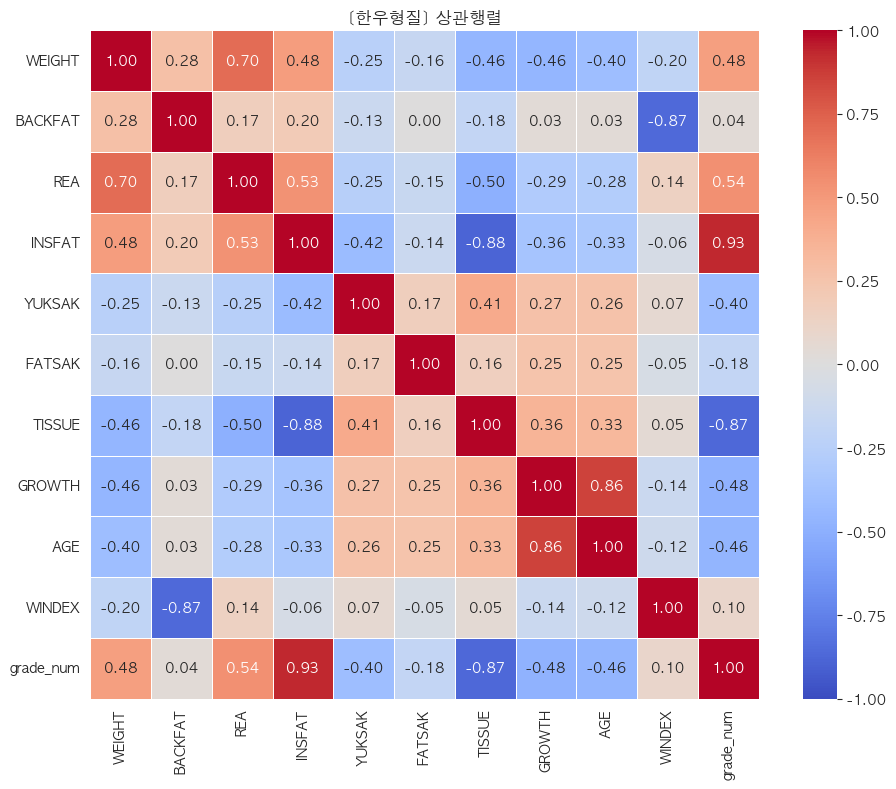

- **이론 매칭**: [E2 §2](E2_EDA_상관과_시각화.md) + **육질 변수 누수**([00-B](00B_우리프로젝트_전체그림.md)).
- **그림 읽는 법**: 11개 형질(WEIGHT·BACKFAT·REA·INSFAT… + grade_num) 사이 상관 행렬.
- **이 그림에서 읽을 것**: **INSFAT↔grade_num 0.93**, **TISSUE↔grade_num −0.87**, TISSUE↔INSFAT −0.88(육질끼리도 강함), WEIGHT↔REA 0.70, **GROWTH↔AGE 0.86**, BACKFAT↔WINDEX −0.87. 즉 **육질 변수들이 등급과·서로 한 몸**처럼 묶임.
- **그래서 어떤 결정으로**: 육질이 등급과 0.87~0.93으로 거의 같다는 건 **"발견이 아니라 정의"**(육질로 등급을 매기니까). → **육질 8개 전부 분류 피처 제외**(누수). 트랙2 분석에서만 참고.
- **만약 달랐다면**: 육질-등급 상관이 0.3 수준이었다면 육질을 피처로 써도 됐을 겁니다. 0.9에 가까우니 "정답지"로 보고 빼는 게 맞습니다.

## 2-4. 기상 그룹 상관 — `13_corr_기상`

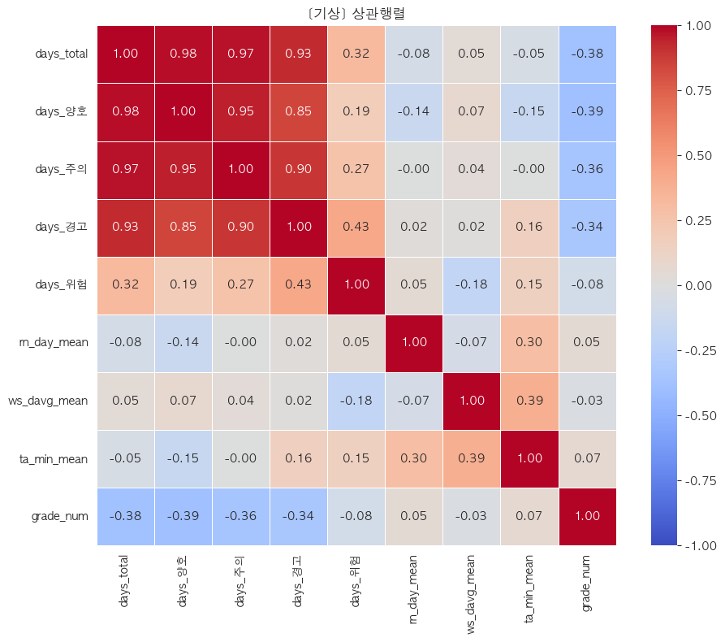

- **이론 매칭**: [E2 §2](E2_EDA_상관과_시각화.md) + **일수 함정**([E3 §2](E3_EDA_기상_시공간_파생.md)).
- **그림 읽는 법**: 9개 기상 변수(days_* + 평균들 + grade_num) 상관.
- **이 그림에서 읽을 것**: **days_total↔days_양호 0.98, ↔days_주의 0.97, ↔days_경고 0.93** — days_* 끼리 극단적으로 강함. grade_num과는 −0.34~−0.39(약한 음). days_위험만 grade −0.08(거의 무관).
- **그래서 어떤 결정으로**: days_* 가 서로 0.9대로 묶인 건 **"다 사육일수에 비례"**(오래 살면 모든 일수가 큼)하기 때문 — 일수 함정. → **절대 일수 대신 비율(ratio_고온)** 로 바꿔야 함([E3 §2](E3_EDA_기상_시공간_파생.md)). 다중공선성도 심하니 회귀에선 정리 필요([R3](R3_다중공선성_VIF.md)).
- **만약 달랐다면**: days_위험이 등급과 −0.5였다면 "심한 더위가 등급을 직접 떨어뜨린다"는 깔끔한 증거였겠죠. 실제론 −0.08로 약해, 더위 효과가 단순하지 않음을 시사합니다.

## 2-5. 농장 그룹 상관 — `13_corr_농장`

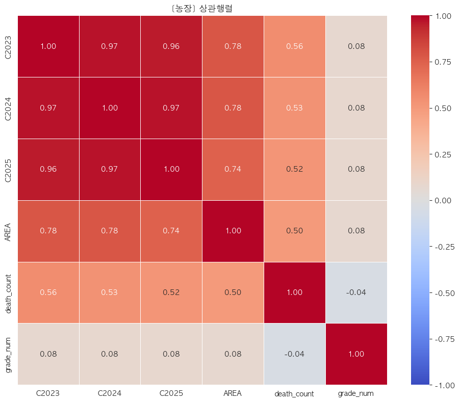

- **이론 매칭**: [E2 §2](E2_EDA_상관과_시각화.md) + **다중공선성**([R3](R3_다중공선성_VIF.md)).
- **그림 읽는 법**: 6개 농장 변수(C2023·C2024·C2025·AREA·death_count·grade_num) 상관.
- **이 그림에서 읽을 것**: **C2023↔C2024 0.97, C2024↔C2025 0.97, C2023↔C2025 0.96** — 연도별 사육두수가 거의 같음(해마다 비슷). AREA↔C 0.74~0.78, death_count↔C 0.50~0.56. 그런데 **grade_num과는 전부 0.08**(거의 무관).
- **그래서 어떤 결정으로**: C2023~25는 셋이 거의 같으니 **하나만 써도 충분**(다중공선성 — [R3](R3_다중공선성_VIF.md)에서 정리). 농장 규모가 등급과 거의 무관(0.08)하다는 것도 중요한 발견 — "큰 농장이 등급도 좋다"는 통념은 데이터상 약함.
- **만약 달랐다면**: 사육두수가 등급과 +0.4였다면 "규모의 경제(큰 농장이 잘 키움)"가 보였겠죠. 0.08이라 그런 효과는 약합니다.

> **참고 — \|r\| ≥ 0.7 강한 상관 쌍 (총 28개, 상위 일부)**
>
> | 변수 쌍 | r | 의미 |
> | --- | --- | --- |
> | days_양호 ↔ days_total | +0.98 | 정의상 묶임 |
> | C2025 ↔ C2024 | +0.97 | 연도 두수 비슷 |
> | grade_num ↔ INSFAT | +0.93 | 등급 정답지 |
> | TISSUE ↔ INSFAT | −0.88 | 육질끼리 |
> | GROWTH ↔ AGE | +0.86 | 월령-성장 |
> | COST_AMT ↔ grade_num | +0.87 | 등급↑→가격↑ |
> | days_total ↔ AGE | +0.80 | 일수 함정 |

---

# ③ 산점도·박스플롯 (14_)

상관이 못 보는 곡선·그룹 차이를 눈으로. 이론은 [E2 §5·§6·§7](E2_EDA_상관과_시각화.md).

## 3-1. 가격 vs 핵심 변수 산점도 — `14_scatter_key`

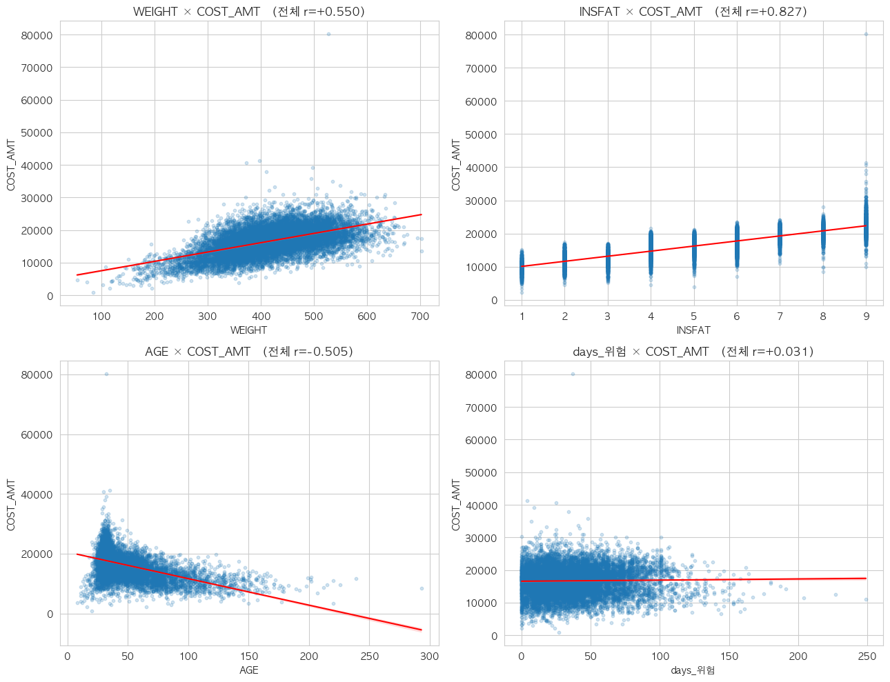

- **이론 매칭**: [E2 §5 산점도](E2_EDA_상관과_시각화.md).
- **그림 읽는 법**: 4개 패널, 점 하나가 소(2만 샘플), 세로축은 가격(COST_AMT), 빨간 선이 추세선. 제목의 r은 전체 상관.
- **이 그림에서 읽을 것**: **WEIGHT×가격 r=+0.55**(우상향), **INSFAT×가격 r=+0.83**(우상향, INSFAT이 1~9 정수라 세로 줄무늬), **AGE×가격 r=−0.51**(우하향 — 늙을수록 쌈), **days_위험×가격 r=+0.03**(거의 평평 — 무관).
- **그래서 어떤 결정으로**: WEIGHT·INSFAT은 가격과 뚜렷한 양의 관계 → 회귀 통제·분류 피처. days_위험이 가격과 무관(0.03)한 건 "심한 더위 단독으로는 가격에 직접 영향 약함"을 시사 → 회귀에서 비율·통제로 정교하게 봐야 함.
- **만약 달랐다면**: days_위험×가격이 −0.4 우하향이었다면 "더위가 가격을 직접 떨어뜨린다"는 깔끔한 1차 증거였겠죠. 평평하니 더위 효과는 교란 통제 후에야 보입니다.

## 3-2. 월령 곡선 관계 (LOWESS) — `14_lowess`

- **이론 매칭**: [E2 §5 LOWESS](E2_EDA_상관과_시각화.md) + [E2 §2.5 Pearson/Spearman](E2_EDA_상관과_시각화.md).
- **그림 읽는 법**: 점이 소, **빨간 선이 LOWESS(부드러운 곡선)**. 왼쪽 AGE×WEIGHT, 오른쪽 AGE×가격.
- **이 그림에서 읽을 것**: 빨간 곡선이 **직선이 아님** — 월령 **30개월 부근에서 정점**을 찍고 그 뒤 완만히 내려감(뒤집힌 모양). 오른쪽 월령 200~300(=17~25년)까지 뻗은 점들 = **노폐우**.
- **그래서 어떤 결정으로**: 이 휘어짐이 "직선(Pearson)이 못 잡는 곡선 관계" → Pearson·Spearman이 달랐던 이유 → **Age_squared(월령²) 제곱항** 생성([E3](E3_EDA_기상_시공간_파생.md)). 회귀에도 비선형 항으로 반영.
- **만약 달랐다면**: 곡선이 직선이었다면 제곱항이 불필요했을 겁니다. 휘어 있어서 제곱항을 추가해 모델이 그 곡선을 표현하게 했습니다.

## 3-3. 등급별 형질 박스플롯 — `14_box_grade`

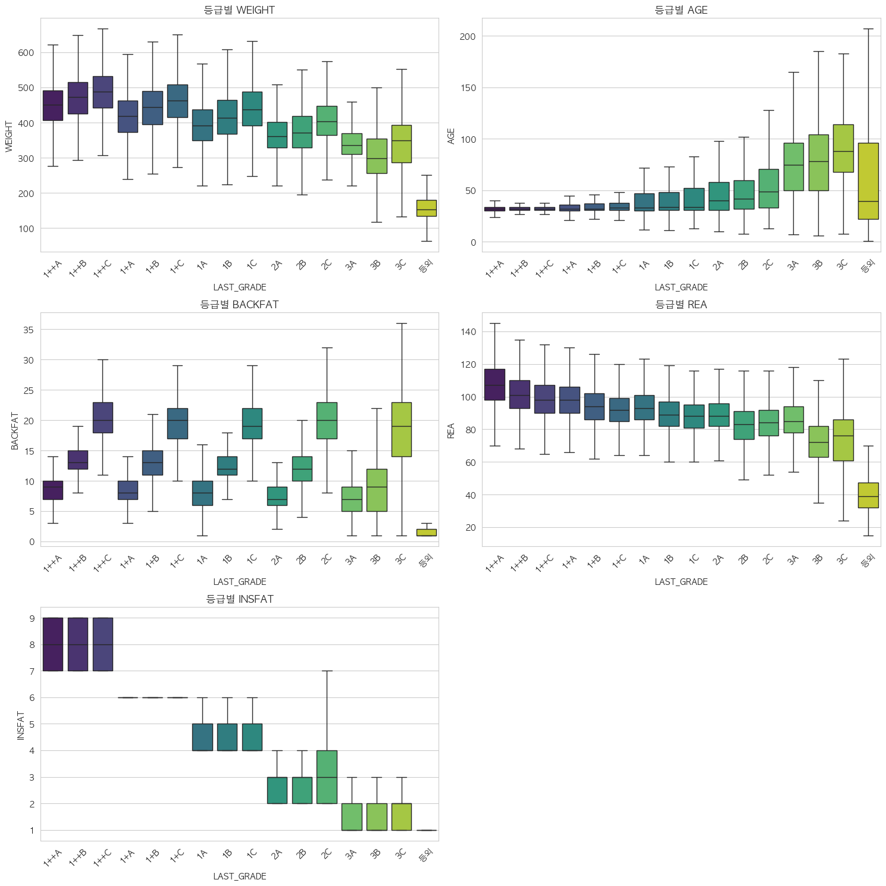

- **이론 매칭**: [E2 §6 박스플롯](E2_EDA_상관과_시각화.md) + WEIGHT 유용성·육질 누수.
- **그림 읽는 법**: 5개 패널(등급별 WEIGHT·AGE·BACKFAT·REA·INSFAT). 가로축 16등급(좌 좋음→우 나쁨), 상자가 그 등급의 분포.
- **이 그림에서 읽을 것**:
  - **WEIGHT**: 좋은 등급일수록 무거움(1++C 중앙 ~490kg → 등외 ~150kg). 대체로 우하향.
  - **AGE**: 좋은 등급은 월령 30 근처로 일정한데, **나쁜 등급(3A/3B/3C/등외)은 월령이 높고 분산이 큼** — 노폐우가 거기 섞임.
  - **INSFAT**: **완벽한 계단**(1++ = 7~9, 1+ = 6, 1 = 4~5, 2 = 2~3, 3 = 1~2, 등외 = 1) — 등급 정답지의 시각적 증거.
  - **REA**: 우하향(1++A 108 → 등외 40).
- **그래서 어떤 결정으로**: WEIGHT가 등급을 잘 가름 → 분류 핵심 피처 확인. INSFAT의 완벽 계단 → "정답지"라 제외(누수)를 눈으로 재확인. 나쁜 등급의 높은 AGE → 노폐우 인지.
- **만약 달랐다면**: WEIGHT 상자가 등급별로 다 겹쳤다면 체중은 쓸모없는 변수였겠죠. 계단처럼 갈리니 강력합니다.

## 3-4. 성별 박스플롯 — `14_box_sex`

- **이론 매칭**: [E2 §6 박스플롯](E2_EDA_상관과_시각화.md) + [E2 §7 검정](E2_EDA_상관과_시각화.md).
- **그림 읽는 법**: 상자 셋(거세·암·수), 세 패널(도체중·근내지방·가격).
- **이 그림에서 읽을 것**: **도체중 중앙값 거세 473 > 수 443 > 암 372kg**. 근내지방·가격도 거세 > 암 > 수 순. 상자가 **확연히 어긋남**.
- **그래서 어떤 결정으로**: 성별이 체격·품질·가격을 크게 가름 → **반드시 넣을 변수**(원-핫). 검정으로도 확인(아래 표, Kruskal-Wallis H=1,088,062.9, p<0.0001).
- **만약 달랐다면**: 세 상자가 겹쳤다면 성별은 무의미했겠죠. 100kg씩 갈리니 1순위 변수입니다.

> **성별 × 도체중 (실제 수치)**
>
> | 성별 | 중앙값(kg) | 마리수 |
> | --- | --- | --- |
> | 거세 | 473 | 1,222,465 |
> | 수 | 443 | 11,820 |
> | 암 | 372 | 1,174,414 |
>
> Kruskal-Wallis H = **1,088,062.9**, p < 0.0001 → 성별 차이 매우 유의.

## 3-5. 도축 계절별 가격 — `14_box_season`

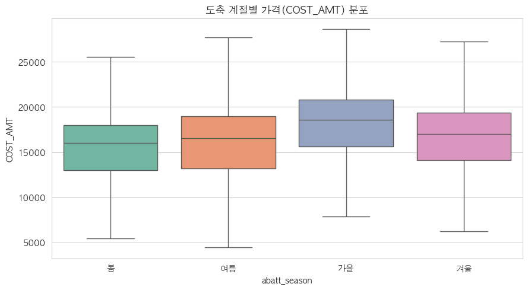

- **이론 매칭**: [E2 §6 박스플롯](E2_EDA_상관과_시각화.md) + 계절 효과.
- **그림 읽는 법**: 상자 넷(봄·여름·가을·겨울), 세로축 가격.
- **이 그림에서 읽을 것**: **가을 중앙값 ~18,500원으로 최고**, 봄 ~16,000 최저, 여름 16,500, 겨울 17,000. 가을(추석)이 뚜렷이 높음.
- **그래서 어떤 결정으로**: 계절(특히 가을 추석)이 가격을 움직임 → **계절 더미**를 회귀의 통제 변수·분류 피처로. 시즌성을 모델이 인지하게 함.
- **만약 달랐다면**: 네 계절이 다 같았다면 계절 변수가 불필요했겠죠. 가을이 솟으니 시즌 통제가 중요합니다.

## 3-6. 시도별 가격 박스플롯 — `14_box_sido`

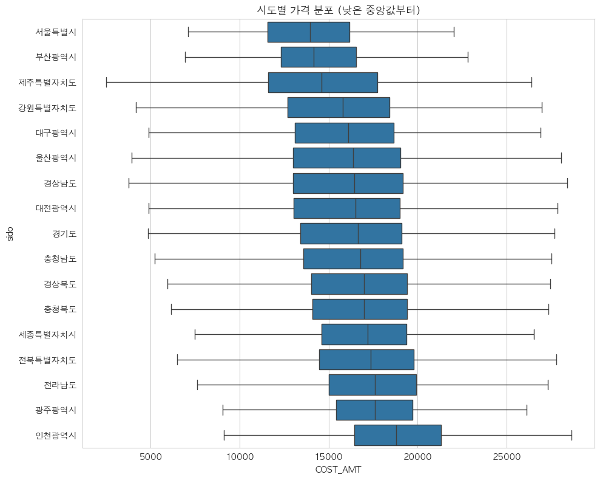

- **이론 매칭**: [E2 §6 박스플롯](E2_EDA_상관과_시각화.md) + 지역 효과([R1 통제](R1_회귀의_목적_인과.md)).
- **그림 읽는 법**: 시도별 상자(중앙값 낮은 순 정렬), 가로축 가격.
- **이 그림에서 읽을 것**: **서울 중앙값 최저(~14,000) → 인천 최고(~18,800)**. 광주·전남·전북도 높은 편, 부산·제주가 낮은 편. 지역마다 가격대가 다름.
- **그래서 어떤 결정으로**: 지역이 가격과 강하게 연관 → 회귀에서 **시도를 통제**해야 더위 효과가 오염 안 됨([R1](R1_회귀의_목적_인과.md)). 시도 원-핫.
- **만약 달랐다면**: 모든 시도가 같은 가격대였다면 지역 통제가 덜 중요했겠죠. 차이가 크니 교란 통제의 핵심 변수입니다.

---

# ④ 기상 분석 (15_)

대회 핵심 주제. 이론은 [E3](E3_EDA_기상_시공간_파생.md).

## 4-1. 등급별 더위 노출 — `15_ratio_by_grade`

- **이론 매칭**: [E3 §3 충격적 결과](E3_EDA_기상_시공간_파생.md) + [상관≠인과(R1)](R1_회귀의_목적_인과.md).
- **그림 읽는 법**: 가로축 16등급(좌 좋음→우 나쁨), 세로축 더위 노출 비율, 색 파랑(좋음)→빨강(나쁨).
- **이 그림에서 읽을 것**: **좋은 등급일수록 상자가 위(더위 ↑)**. 1++A 중앙값 ≈ **0.425**, 등외 ≈ **0.40**. 즉 좋은 소가 더위를 더 겪음 — **상식과 반대**.
- **그래서 어떤 결정으로**: "더위가 좋다"로 읽으면 안 됨 → **교란(지역) 의심** → 회귀에서 지역 통제([R1](R1_회귀의_목적_인과.md)). EDA는 "이상하다"를 발견, 통제는 모델링이.
- **만약 달랐다면**: 나쁜 등급일수록 더위가 많았다면(우상향) "더위=품질저하" 상식과 맞아 통제가 덜 급했겠죠. 반대로 나와서 교란을 깊이 파게 됐습니다.

## 4-2. 더위 구간별 평균 등급 — `15_bin_grade`

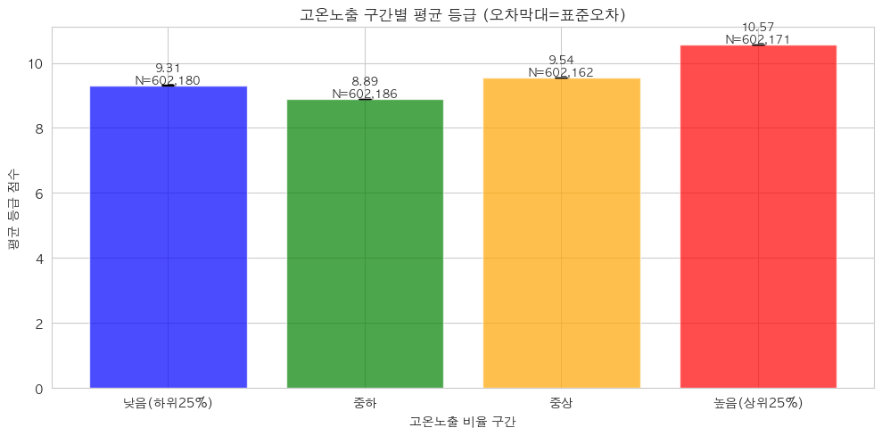

- **이론 매칭**: [E3 §3 교란](E3_EDA_기상_시공간_파생.md) + [R1 상관≠인과](R1_회귀의_목적_인과.md).
- **그림 읽는 법**: 더위 노출을 4구간(낮음/중하/중상/높음)으로 나눠, 막대 높이가 그 구간 평균 등급. 오차막대는 표준오차.
- **이 그림에서 읽을 것**: 네 구간 평균 등급이 **단조롭게 변하지 않습니다.**
  | 더위 구간 | 낮음(하위25%) | 중하 | 중상 | 높음(상위25%) |
  | --- | --- | --- | --- | --- |
  | 평균 등급 | 9.31 | **8.89** ↓ | 9.54 ↑ | **10.57** ↑ |

  낮음(9.31)에서 **중하(8.89)로 한 번 내려갔다가** 중상(9.54)·높음(10.57)으로 **다시 올라가는 U자**입니다. "더위 구간을 올릴수록 등급이 쭉 오른다(단조 증가)"가 **아니라는 점**이 핵심 — 단순한 인과로 설명 안 되는 모양입니다.
- **그래서 어떤 결정으로**: 4-1과 같은 반직관 + U자 → 더위-등급은 단순하지 않음(단조도 아님). **회귀에서 지역·성별·월령 통제 후 순수 효과** 추정 필요. 검정으로도 확인(Mann-Whitney, 아래 표).
- **만약 달랐다면**: 구간이 올라갈수록 등급이 **단조 감소**했다면 "더위 피해"가 명확했겠죠. 단조 증가였다면 "더위가 좋다"는 (틀린) 단순 결론을 내리기 쉬웠을 거고요. **U자(오르락내리락)** 라서 "단일 원인이 아니라 교란이 섞였다"를 더 강하게 의심하게 됩니다.

> **더위 노출 상·하위 비교 (Mann-Whitney U)**
>
> | 그룹 | 평균 등급 |
> | --- | --- |
> | 더위 하위 25% | 9.313 |
> | 더위 상위 25% | 10.568 |
>
> Mann-Whitney p ≈ 0 → 차이는 확실히 존재(방향이 상식과 반대일 뿐).

## 4-3. 출생 계절별 등급 — `15_birth_season`

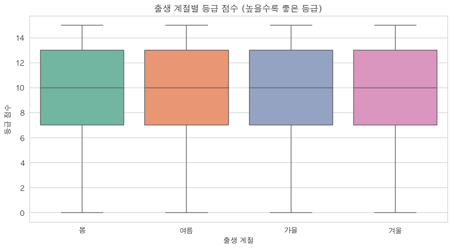

- **이론 매칭**: [E3 §4 시간 패턴](E3_EDA_기상_시공간_파생.md) + [E2 §7 검정](E2_EDA_상관과_시각화.md).
- **그림 읽는 법**: 상자 넷(봄·여름·가을·겨울 출생), 세로축 등급 점수.
- **이 그림에서 읽을 것**: **네 계절 상자가 거의 동일**(중앙값 모두 10, 상자 7~13). 출생 계절에 따른 등급 차이가 **거의 없음**.
- **그래서 어떤 결정으로**: "여름 출생 송아지가 평생 불리하다" 같은 가설은 **데이터가 지지 안 함**. 출생 계절 변수의 비중을 낮게 봄(통계적으론 유의하나 효과 미미 — H=610.4는 성별 H 109만의 0.06% 수준).
- **만약 달랐다면**: 여름 출생 상자가 확 낮았다면 "초기 더위의 평생 효과"라는 흥미로운 결과였겠죠. 거의 같아서 "효과 미미"가 정답입니다. **"차이 없음"도 훌륭한 결과**입니다.

## 4-4. 더위 노출 vs 가격 — `15_ratio_vs_cost`

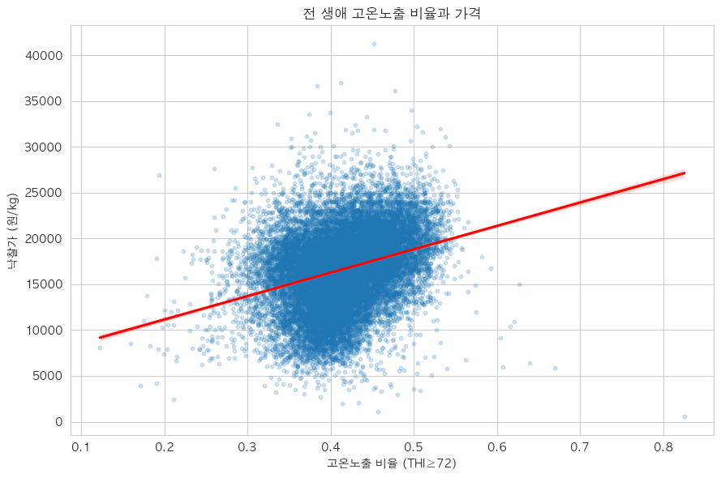

- **이론 매칭**: [E3 더위](E3_EDA_기상_시공간_파생.md) + **R 트랙 핵심(더위→가격)**([R1](R1_회귀의_목적_인과.md)·[R5](R5_계수해석_한계효과.md)).
- **그림 읽는 법**: 가로축 더위 노출 비율, 세로축 가격, 점이 소, 빨간 추세선.
- **이 그림에서 읽을 것**: 추세선이 **우상향(r ≈ +0.30)** — 더위 많이 겪은 소가 가격도 높음. 등급(4-1)과 같은 **반직관** 패턴.
- **그래서 어떤 결정으로**: 회귀팀이 가장 주목할 그림. 단순 상관은 +0.30이지만 이건 **교란(지역) 오염**일 수 있음 → 회귀에서 지역·계절·연도 통제 후 진짜 부호·크기를 봄([R5](R5_계수해석_한계효과.md)). 통제 후에도 +면 남은 교란 의심.
- **만약 달랐다면**: 추세선이 −0.3 우하향이었다면 "더위가 가격을 떨어뜨린다"는 상식적 1차 증거였겠죠. +0.3이라 통제가 필수임을 알려줍니다.

## 4-5. 시도별 더위 vs 등급 — `15_sido_heat_grade`

- **이론 매칭**: [E3 §3 교란 증거](E3_EDA_기상_시공간_파생.md) + [R1 교란](R1_회귀의_목적_인과.md).
- **그림 읽는 법**: 점 하나가 시도, 가로축 평균 더위 노출, 세로축 평균 등급, 점 크기 마릿수.
- **이 그림에서 읽을 것**: 점들이 깔끔한 직선이 아니라 **흩어짐**. **광주(가장 더움 0.453) 등급 9.18(낮음)**, **인천(선선 0.377) 등급 11.13(높음)** — "더우면 등급 높다"가 시도 단위에서 **깨짐**.
- **그래서 어떤 결정으로**: 더위-등급 관계에 **지역 교란이 강하게 끼어 있다**는 결정적 증거 → 회귀 통제의 핵심 근거([R1](R1_회귀의_목적_인과.md)).
- **만약 달랐다면**: 점들이 우상향 직선으로 깔끔했다면 "더위→등급"이 진짜일 가능성이 커졌겠죠. 흩어지고 반례(광주/인천)가 있어 교란으로 결론냅니다.

---

# ⑤ 시공간 패턴 (16_)

시간·지역 축. 이론은 [E3 §4](E3_EDA_기상_시공간_파생.md).

## 5-1. 도축 월별 가격·출하량 — `16_monthly`

- **이론 매칭**: [E3 §4 시즌성](E3_EDA_기상_시공간_파생.md).
- **그림 읽는 법**: 가로축 도축 월(1~12), 막대=출하량, 빨간 선=평균 가격, 점선=연평균.
- **이 그림에서 읽을 것**: **9월 18,476원 최고(추석)**, 10~12월 높음(연말), 5월 15,299 최저. **1~2월(설)은 16,142~16,144로 연평균 부근** — 솟지 않음.
- **그래서 어떤 결정으로**: 추석·연말 시즌성 확인 → 계절·월 변수로 통제. **"설 효과 없음"** 을 데이터로 확정(처음엔 "추석·설"로 적었다가 교정 — EDA가 선입견을 고친 사례).
- **만약 달랐다면**: 1~2월이 솟았다면 "설 효과 있음"으로 보고했겠죠. 중간이라 없습니다. 그림이 보고서 문장을 바꿉니다.

> **도축 월별 평균 가격 (원/kg)**
>
> | 월 | 1 | 2 | 3 | 4 | 5 | 6 | 7 | 8 | **9** | 10 | 11 | 12 |
> | --- | --- | --- | --- | --- | --- | --- | --- | --- | --- | --- | --- | --- |
> | 가격 | 16,142 | 16,144 | 15,703 | 15,779 | **15,299** | 15,391 | 15,929 | 16,930 | **18,476** | 17,827 | 17,752 | 17,896 |

## 5-2. 도축 연도별 추세 — `16_yearly`

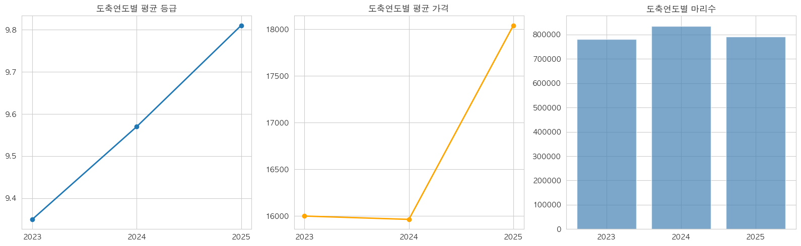

- **이론 매칭**: [E3 §4](E3_EDA_기상_시공간_파생.md) + **"점 3개 과대해석 금지"**.
- **그림 읽는 법**: 3개 패널(연도별 평균 등급·평균 가격·마리수), 가로축 2023~2025.
- **이 그림에서 읽을 것**: 평균 등급 9.35 → 9.57 → **9.81**(상승), 평균 가격 16,000 → 15,964 → **18,040**(2025 급등, +12.8%), 마리수 78만/84만/79만(비슷).
- **그래서 어떤 결정으로**: 연도를 변수(연도 더미)로 통제 — 특히 2025 가격 급등이 다른 효과로 새는 걸 막음([R6 셀3](R6_실습_코드따라하기.md)). 단 **점 3개라 "추세"로 단정 금지**, 비교 수준으로만.
- **만약 달랐다면**: 5년·10년 데이터였다면 추세선을 그려 트렌드를 말할 수 있었겠죠. 3개뿐이라 "연도 차이가 있다"까지만, 연도 더미로 통제합니다.

## 5-3. 시도별 평균 등급 — `16_sido_grade`

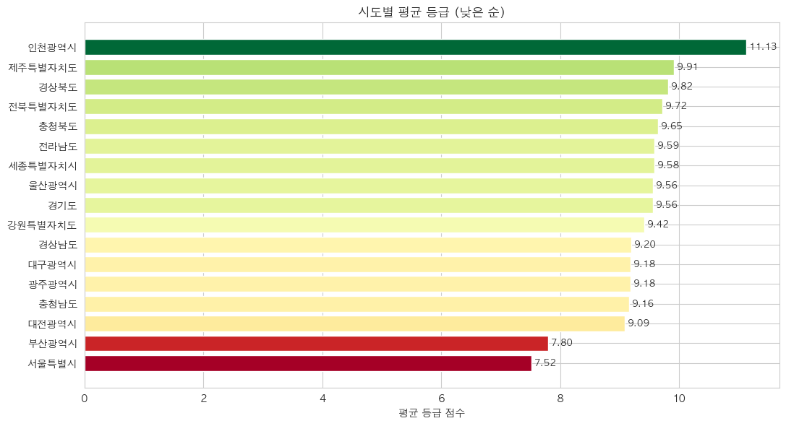

- **이론 매칭**: [E3 §4](E3_EDA_기상_시공간_파생.md) + **지역 통제 근거**([R1](R1_회귀의_목적_인과.md)).
- **그림 읽는 법**: 시도별 평균 등급 막대(낮은 순), 색 빨강(낮음)~초록(높음).
- **이 그림에서 읽을 것**: **인천 11.13 최고**, 제주 9.91, 경북 9.82, 전북 9.72…(중위권 9.1~9.7), **부산 7.80·서울 7.52 최저**. 지역별 등급 격차가 큼(7.5~11.1).
- **그래서 어떤 결정으로**: 지역이 등급과 강하게 연관 → 회귀에서 **시도 통제 필수**([R1](R1_회귀의_목적_인과.md)). 단 인천(11.13)은 마릿수가 적어(1.5만) 소수 정예 효과일 수 있음 — 마릿수 함께 봐야.
- **만약 달랐다면**: 모든 시도가 9.5 근처로 같았다면 지역 통제가 덜 중요했겠죠. 7.5~11.1로 갈리니 핵심 교란 변수입니다.

## 5-4. 시도 × 등급 분포 히트맵 — `16_sido_grade_heatmap`

- **이론 매칭**: [E3 §4](E3_EDA_기상_시공간_파생.md) + [R1 통제](R1_회귀의_목적_인과.md).
- **그림 읽는 법**: 세로축 시도, 가로축 등급(좌 좋음→우 나쁨), 칸 색이 그 지역에서 해당 등급 비율(%, 진할수록 많음, 행 기준 정규화).
- **이 그림에서 읽을 것**: 시도마다 **색 패턴이 확연히 다름** — 어떤 지역은 왼쪽(좋은 등급)이 진하고, 어떤 지역은 오른쪽이 진함. 평균(5-3) 너머 **분포 자체가 지역마다 다르다**는 것.
- **그래서 어떤 결정으로**: 지역이 등급 분포를 통째로 바꿈 → 회귀 지역 통제의 추가 근거. 단순 평균뿐 아니라 분포 형태도 다르다는 깊은 확인.
- **만약 달랐다면**: 모든 행(시도)의 색 패턴이 똑같았다면 지역은 등급 분포에 무관했겠죠. 패턴이 다 달라서 지역 효과가 분명합니다.

---

# 부록 A. 검정 결과 종합표

EDA에서 돌린 통계 검정 결과입니다([E2 §7](E2_EDA_상관과_시각화.md) 이론).

| 검정 | 비교 대상 | 통계량 | p값 | 결론 |
| --- | --- | --- | --- | --- |
| Kruskal-Wallis | 성별 × 도체중 | H=1,088,062.9 | <0.0001 | 성별 차이 매우 유의 |
| Kruskal-Wallis | 등급 × 도체중 | H=697,821.7 | <0.0001 | 등급-체중 관계 유의 |
| Kruskal-Wallis | 계절 × 가격 | H=80,818.7 | <0.0001 | 계절 차이 유의 |
| Kruskal-Wallis | 출생계절 × 등급 | H=610.4 | 5.7×10⁻¹³² | 유의하나 효과 미미(H 작음) |
| Mann-Whitney U | 더위 상위25% vs 하위25% 등급 | — | ≈0 | 차이 존재(방향 반직관) |

> **읽는 주의**: 우리는 240만 행이라 p값이 거의 다 <0.0001입니다. **p값(유무)보다 통계량 크기·효과 크기**를 봐야 합니다. 예: 성별 H(109만)는 출생계절 H(610)의 약 1,800배 — "성별 효과는 크고 출생계절 효과는 작다"가 핵심.

# 부록 B. 그림 없는 핵심 수치표

## B-1. 노폐우 (숨은 집단)

| 구분 | 평균 도축 나이 | 평균 등급 | 마리수 |
| --- | --- | --- | --- |
| 2015년 이전 출생(노폐우) | 약 10.3년 | 3.73 | 75,972 (3.2%) |
| 전체 | 약 3.3년 | 9.58 | 2,408,699 |

> 노폐우는 비육우(거세우 표준 30개월)와 모집단이 다른 번식용 도태 암소. 등급이 낮은 게 날씨 탓이 아니라 집단 특성. → 별도 집단으로 인지([E3](E3_EDA_기상_시공간_파생.md)).

## B-2. 시도별 평균 등급 (전체 17개)

| 시도 | 평균 등급 | | 시도 | 평균 등급 |
| --- | --- | --- | --- | --- |
| 인천 | 11.13 | | 강원 | 9.42 |
| 제주 | 9.91 | | 경남 | 9.20 |
| 경북 | 9.82 | | 대구 | 9.18 |
| 전북 | 9.72 | | 광주 | 9.18 |
| 충북 | 9.65 | | 충남 | 9.16 |
| 전남 | 9.59 | | 대전 | 9.09 |
| 세종 | 9.58 | | 부산 | 7.80 |
| 울산 | 9.56 | | 서울 | 7.52 |
| 경기 | 9.56 | | | |

## B-3. 도축 연도별 요약

| 연도 | 마리수 | 평균 등급 | 평균 가격(원/kg) |
| --- | --- | --- | --- |
| 2023 | 781,368 | 9.35 | 15,999.88 |
| 2024 | 835,792 | 9.57 | 15,964.38 |
| 2025 | 791,539 | 9.81 | 18,040.53 (+12.8%) |

## B-4. THI 등급 분포

| 등급 | THI 구간 | 비율 |
| --- | --- | --- |
| 양호 | < 72 | 61.9% |
| 주의 | 72~78 | 14.6% |
| 경고 | 78~89 | 21.4% |
| 위험 | 89~98 | 2.1% |
| 폐사 | ≥ 98 | 0% (최대 97.65) |

---

# 부록 C. 전체 그림 한눈에 (체크리스트)

23개 그림이 다 들어갔는지 확인용입니다.

| # | 그림 | 묶음 | 한 줄 결론 |
| --- | --- | --- | --- |
| 1 | 00_merge_grade_dist | 전처리 | 58배 불균형 → Macro-F1·가중치 |
| 2 | 00_merge_missing | 전처리 | 가격37%·혈통38% 결측 → NaN 유지 |
| 3 | 00_merge_thi_dist | 전처리 | THI 쌍봉, 위험일 희소 |
| 4 | 13_corr_key | 상관 | 육질·가격 강함(누수), WEIGHT 유용 |
| 5 | 13_grade_corr | 상관 | 피처 선택 출발점 |
| 6 | 13_corr_한우형질 | 상관 | 육질=등급 정의(누수) |
| 7 | 13_corr_기상 | 상관 | days_* 일수 함정 → 비율로 |
| 8 | 13_corr_농장 | 상관 | C2023~25 중복, 등급과 무관 |
| 9 | 14_scatter_key | 산점도 | WEIGHT·INSFAT 양, days_위험 무관 |
| 10 | 14_lowess | 산점도 | 월령 곡선 → Age_squared |
| 11 | 14_box_grade | 박스 | WEIGHT 계단·INSFAT 정답지 |
| 12 | 14_box_sex | 박스 | 성별이 체격 가름(H=109만) |
| 13 | 14_box_season | 박스 | 가을 가격 최고 |
| 14 | 14_box_sido | 박스 | 지역 가격 격차 |
| 15 | 15_ratio_by_grade | 기상 | 좋은등급=더위↑(반직관) |
| 16 | 15_bin_grade | 기상 | 더위구간↑→등급↑(U자) |
| 17 | 15_birth_season | 기상 | 출생계절 효과 미미 |
| 18 | 15_ratio_vs_cost | 기상 | 더위↑→가격↑(r0.30, 회귀핵심) |
| 19 | 15_sido_heat_grade | 기상 | 광주/인천 교란 증거 |
| 20 | 16_monthly | 시공간 | 9월 추석 피크, 설 효과 없음 |
| 21 | 16_yearly | 시공간 | 2025 가격 급등(점3개 주의) |
| 22 | 16_sido_grade | 시공간 | 인천11.1~서울7.5 |
| 23 | 16_sido_grade_heatmap | 시공간 | 지역별 등급분포 다름 |

> 🎯 **전체를 관통하는 한 줄**: EDA 결과가 전부 모델링 결정으로 이어졌습니다 — **누수 차단(육질·가격 제외)**, **좋은 피처(WEIGHT·daily_gain)**, **곡선 처리(Age_squared)**, **교란 통제(지역·계절·연도)**, **불균형 대응(Macro-F1·가중치)**. 이 23개 그림이 분류·회귀의 모든 선택의 근거입니다.

> 이론을 다시 보려면 → [E1](E1_EDA_단변량_분포.md)·[E2](E2_EDA_상관과_시각화.md)·[E3](E3_EDA_기상_시공간_파생.md). 모델링으로 → 분류 [C1](C1_분류문제와_평가지표.md), 회귀 [R1](R1_회귀의_목적_인과.md).
